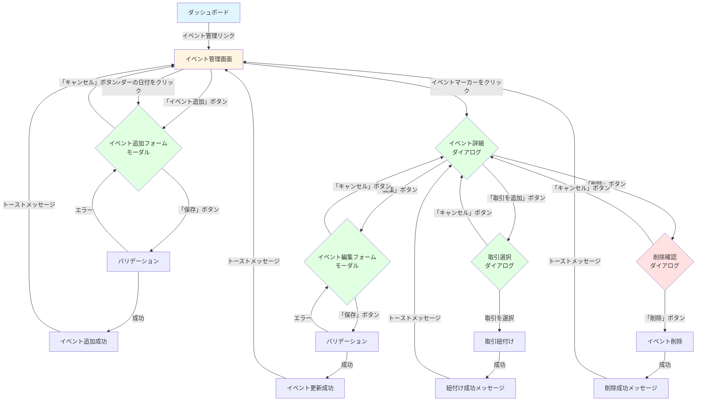

# 画面遷移図

このドキュメントでは、イベントメモ機能（FR-021）の画面遷移を記載しています。

## 目次

1. [画面遷移全体図](#画面遷移全体図)
2. [各画面の詳細](#各画面の詳細)
3. [モーダル・ダイアログ遷移](#モーダルダイアログ遷移)
4. [画面仕様](#画面仕様)

---

## 画面遷移全体図

### メイン遷移フロー

### 画面の種類

- **イベント管理画面**: カレンダー表示とイベント一覧、追加・編集・削除のエントリーポイント
- **イベント追加フォーム**: モーダルダイアログで新規イベントを作成
- **イベント編集フォーム**: モーダルダイアログで既存イベントを編集
- **イベント詳細ダイアログ**: イベントの詳細情報と関連取引を表示
- **削除確認ダイアログ**: 削除前の確認
- **取引選択ダイアログ**: イベントと紐付ける取引を選択

---

## 各画面の詳細

### 1. イベント管理画面

#### 画面ID

`event-management`

#### URL

`/events`

#### 概要

カレンダー表示とイベント一覧を表示し、イベントの追加・編集・削除を行う画面

#### 表示内容

**ヘッダー**:

- タイトル: 「イベント管理」
- 「イベント追加」ボタン

**カレンダー表示**:

- 月次カレンダー表示
- イベントマーカー（カテゴリ別の色分け）
- 日付クリックでイベント追加フォームを表示

**イベント一覧**:

- 日付順にソート
- カテゴリ別の色分け
- イベントクリックで詳細ダイアログを表示

#### 操作

- 「イベント追加」ボタンクリック → イベント追加フォーム表示
- カレンダーの日付クリック → イベント追加フォーム表示（日付が自動入力）
- イベントマーカークリック → イベント詳細ダイアログ表示
- イベント一覧のアイテムクリック → イベント詳細ダイアログ表示

---

### 2. イベント追加フォーム

#### 画面ID

`event-form-create`

#### 表示方法

モーダルダイアログ

#### 概要

新規イベントを作成するフォーム

#### 表示内容

**フォーム項目**:

- 日付: 日付ピッカー（必須）
- タイトル: テキスト入力（必須、1-100文字）
- カテゴリ: セレクトボックス（必須）
  - 就学関連
  - 高額購入
  - 旅行
  - 医療
  - ライフイベント
  - 投資
  - その他
- 説明: テキストエリア（任意、最大1000文字）
- タグ: タグ入力（任意、最大10個）

**ボタン**:

- 「保存」ボタン
- 「キャンセル」ボタン

#### 操作

- 「保存」ボタンクリック → バリデーション → API呼び出し → 成功時はモーダルを閉じて一覧を更新
- 「キャンセル」ボタンクリック → モーダルを閉じる

---

### 3. イベント編集フォーム

#### 画面ID

`event-form-edit`

#### 表示方法

モーダルダイアログ

#### 概要

既存イベントを編集するフォーム

#### 表示内容

イベント追加フォームと同じ（初期値が入力済み）

#### 操作

- 「保存」ボタンクリック → バリデーション → API呼び出し → 成功時はモーダルを閉じて一覧を更新
- 「キャンセル」ボタンクリック → モーダルを閉じる

---

### 4. イベント詳細ダイアログ

#### 画面ID

`event-detail`

#### 表示方法

モーダルダイアログ

#### 概要

イベントの詳細情報と関連取引を表示するダイアログ

#### 表示内容

**イベント情報**:

- 日付
- タイトル
- カテゴリ（カテゴリ別の色分け）
- 説明
- タグ

**関連取引**:

- 取引一覧（日付、金額、説明）
- 「取引を追加」ボタン

**ボタン**:

- 「編集」ボタン
- 「削除」ボタン
- 「閉じる」ボタン

#### 操作

- 「編集」ボタンクリック → イベント編集フォーム表示
- 「削除」ボタンクリック → 削除確認ダイアログ表示
- 「取引を追加」ボタンクリック → 取引選択ダイアログ表示
- 「閉じる」ボタンクリック → ダイアログを閉じる

---

### 5. 削除確認ダイアログ

#### 画面ID

`event-delete-confirm`

#### 表示方法

モーダルダイアログ

#### 概要

イベント削除前の確認ダイアログ

#### 表示内容

- 確認メッセージ: 「このイベントを削除しますか？」
- 警告: 「関連する取引との紐付けも解除されます」

**ボタン**:

- 「削除」ボタン（危険色）
- 「キャンセル」ボタン

#### 操作

- 「削除」ボタンクリック → API呼び出し → 成功時はダイアログを閉じて一覧を更新
- 「キャンセル」ボタンクリック → ダイアログを閉じる

---

### 6. 取引選択ダイアログ

#### 画面ID

`transaction-select`

#### 表示方法

モーダルダイアログ

#### 概要

イベントと紐付ける取引を選択するダイアログ

#### 表示内容

**取引一覧**:

- 日付順にソート
- 検索機能
- 日付範囲フィルタ
- 各取引: 日付、金額、説明、カテゴリ

**ボタン**:

- 「選択」ボタン
- 「キャンセル」ボタン

#### 操作

- 取引を選択 → 「選択」ボタンクリック → API呼び出し → 成功時はダイアログを閉じて詳細を更新
- 「キャンセル」ボタンクリック → ダイアログを閉じる

---

## モーダル・ダイアログ遷移

### モーダルの重ね合わせ

モーダルは最大1つまで表示可能。新しいモーダルを開く場合は、既存のモーダルを閉じる。

### 遷移パターン

1. **イベント追加 → 成功**
   - イベント追加フォーム → トーストメッセージ → イベント管理画面（一覧更新）

2. **イベント編集 → 成功**
   - イベント詳細ダイアログ → イベント編集フォーム → トーストメッセージ → イベント管理画面（一覧更新）

3. **イベント削除 → 成功**
   - イベント詳細ダイアログ → 削除確認ダイアログ → トーストメッセージ → イベント管理画面（一覧更新）

4. **取引紐付け → 成功**
   - イベント詳細ダイアログ → 取引選択ダイアログ → トーストメッセージ → イベント詳細ダイアログ（関連取引更新）

---

## 画面仕様

### レスポンシブデザイン

- **PC**: カレンダーとイベント一覧を横並び表示
- **タブレット**: カレンダーとイベント一覧を縦並び表示
- **スマートフォン**: カレンダーとイベント一覧を縦並び表示、モーダルは全画面表示

### カテゴリ別の色分け

| カテゴリ       | 色       | 説明    |
| -------------- | -------- | ------- |
| 就学関連       | 青       | #2196F3 |
| 高額購入       | オレンジ | #FF9800 |
| 旅行           | 緑       | #4CAF50 |
| 医療           | 赤       | #F44336 |
| ライフイベント | 紫       | #9C27B0 |
| 投資           | 黄       | #FFC107 |
| その他         | 灰       | #9E9E9E |

### ローディング表示

- API呼び出し中はローディングスピナーを表示
- ボタンは無効化

### エラー表示

- バリデーションエラー: フォーム項目の下にエラーメッセージを表示
- APIエラー: トーストメッセージでエラーを表示

### 成功メッセージ

- トーストメッセージで成功を表示（3秒後に自動非表示）

---

## チェックリスト

画面遷移図作成時の確認事項：

- [x] すべての画面が定義されている
- [x] 画面遷移フローが明確
- [x] モーダル・ダイアログの遷移が明確
- [x] 画面仕様が記載されている
- [x] レスポンシブデザインが考慮されている
