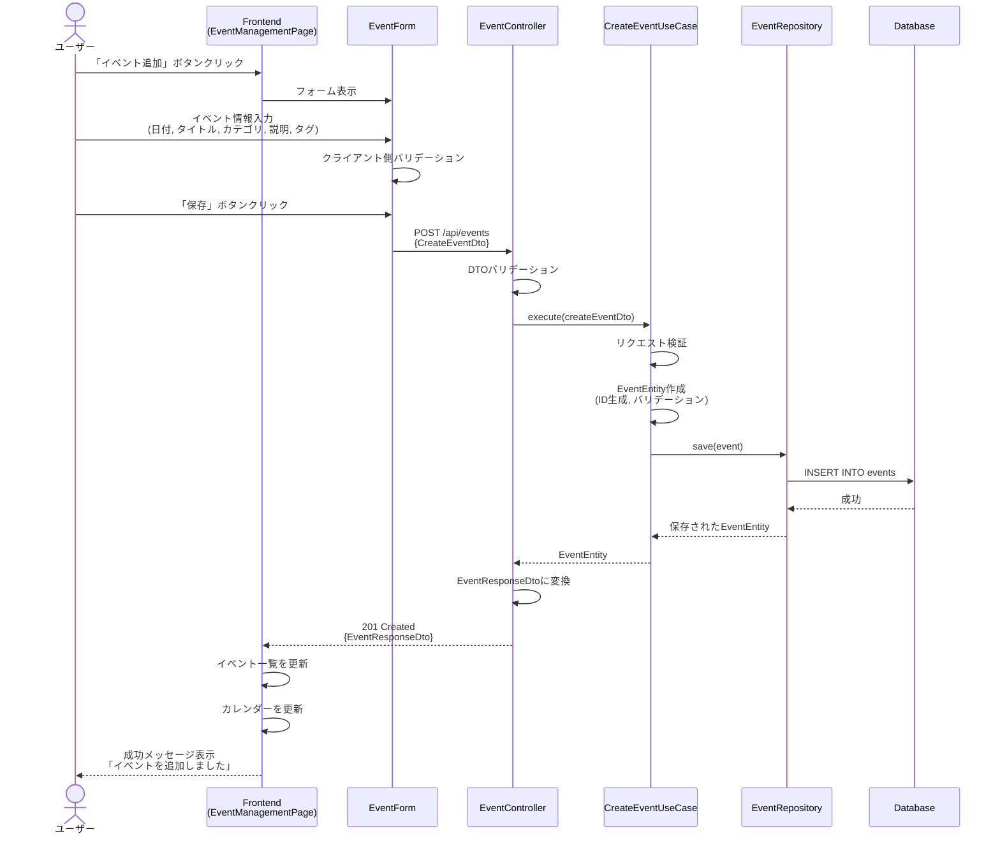
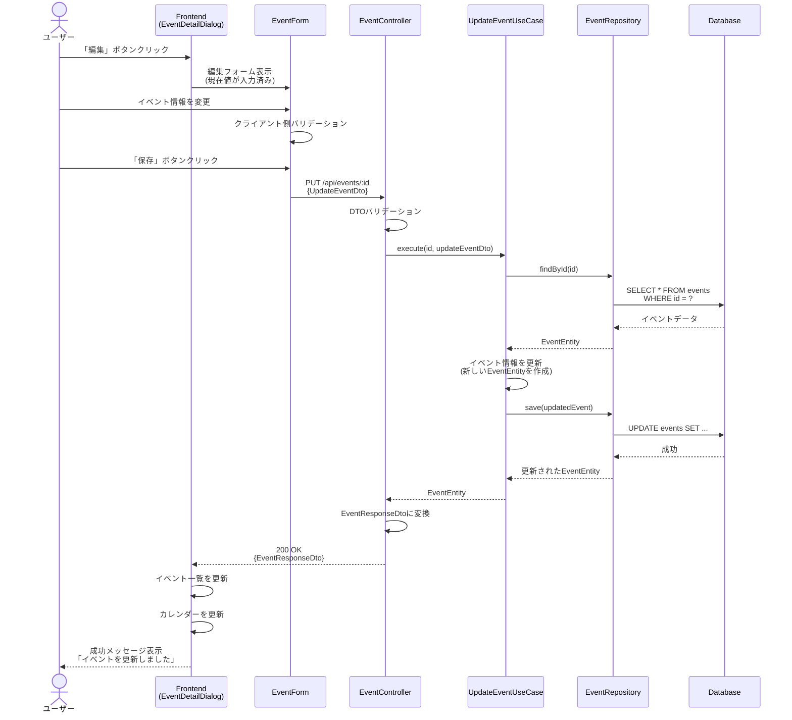
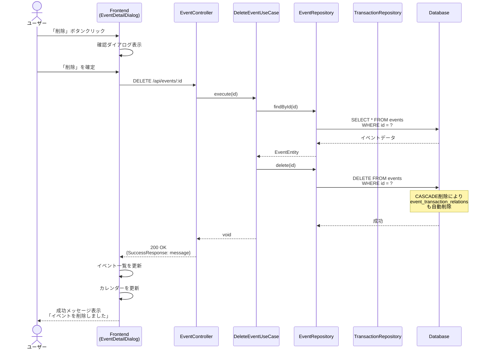
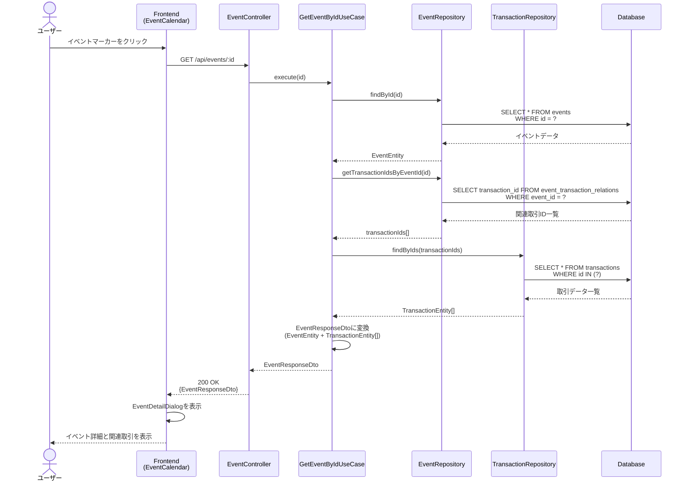
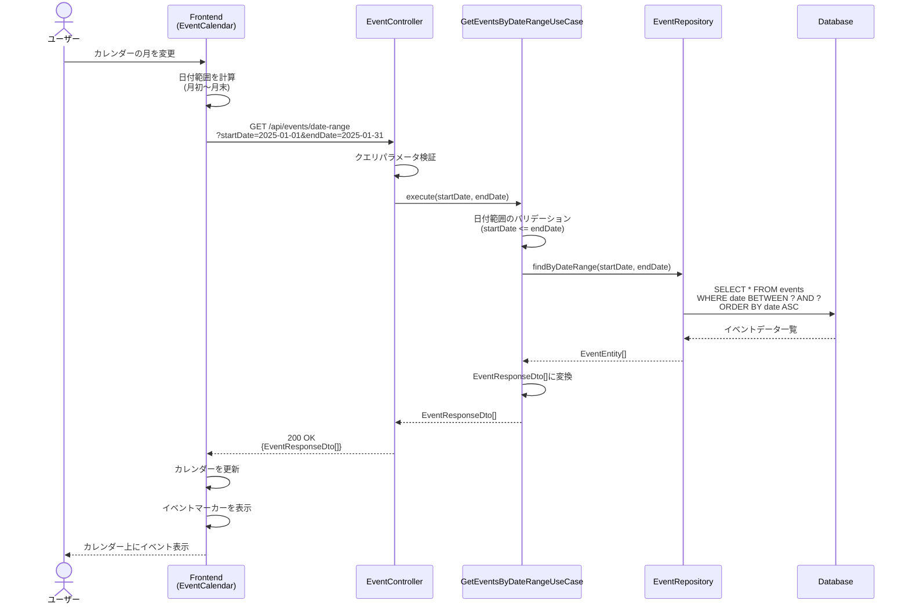
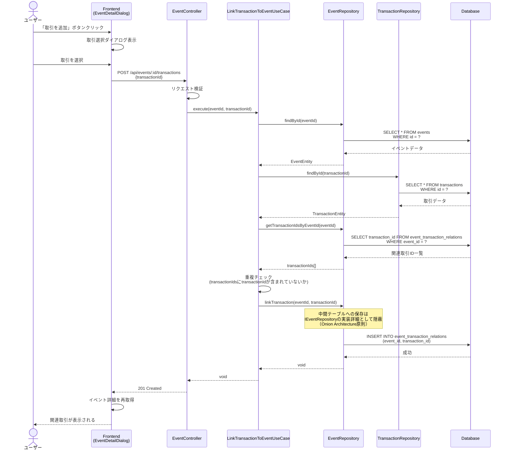
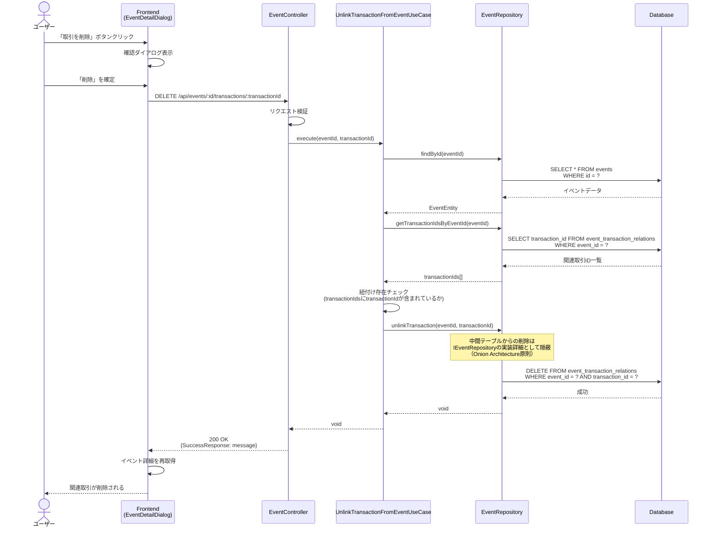
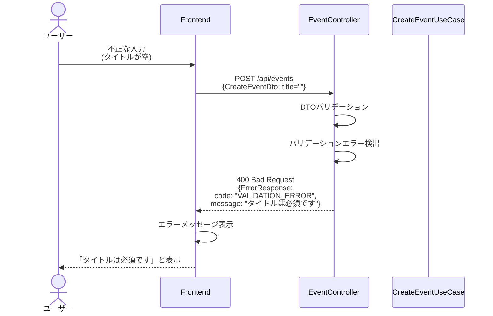
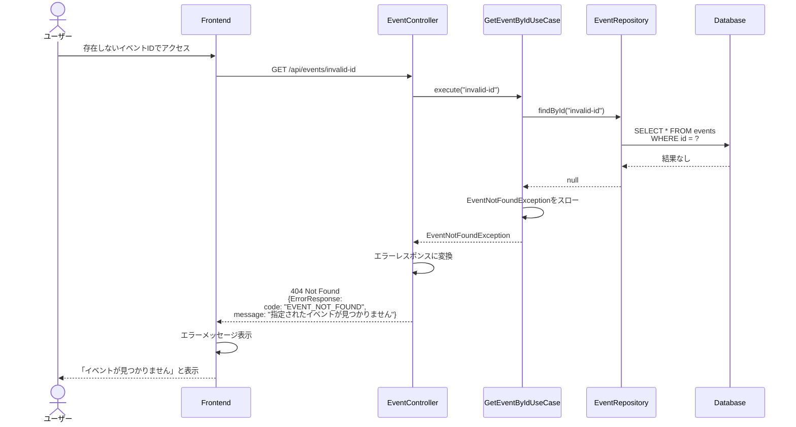
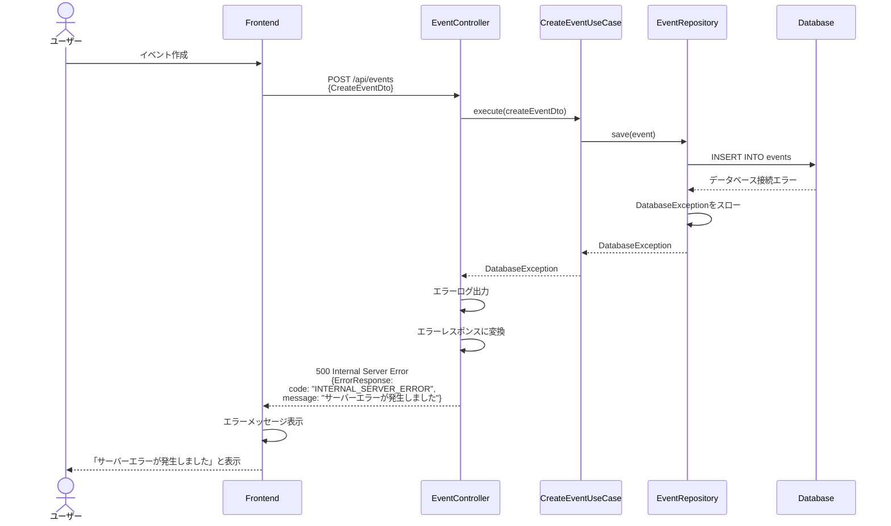

# シーケンス図

このドキュメントでは、イベントメモ機能（FR-021）の処理フローをシーケンス図で記載しています。

## 目次

1. [イベント作成のフロー](#イベント作成のフロー)
2. [イベント更新のフロー](#イベント更新のフロー)
3. [イベント削除のフロー](#イベント削除のフロー)
4. [イベント詳細取得のフロー](#イベント詳細取得のフロー)
5. [日付範囲でのイベント取得のフロー](#日付範囲でのイベント取得のフロー)
6. [取引との紐付けのフロー](#取引との紐付けのフロー)
7. [取引との紐付け解除のフロー](#取引との紐付け解除のフロー)
8. [エラーハンドリングフロー](#エラーハンドリングフロー)

---

## イベント作成のフロー

### 概要

**ユースケース**: ユーザーが新しいイベントを追加する

**アクター**: ユーザー

**前提条件**:

- ユーザーがイベント管理画面にアクセスしている
- 有効な日付とタイトルが入力されている

**成功時の結果**:

- 新しいイベントがデータベースに保存される
- イベント一覧に新規イベントが表示される
- カレンダー上にイベントマーカーが表示される

### 正常系フロー



### ステップ詳細

1. **ユーザーアクション**
   - イベント管理画面で「イベント追加」ボタンをクリック

2. **フォーム表示**
   - EventFormコンポーネントがモーダルで表示される
   - 必須項目: 日付、タイトル、カテゴリ
   - 任意項目: 説明、タグ

3. **Frontend バリデーション**
   - 日付: 必須、妥当な日付
   - タイトル: 必須、1-100文字
   - カテゴリ: 必須、EventCategoryの値
   - 説明: 任意、最大1000文字

4. **API リクエスト**
   - エンドポイント: `POST /api/events`
   - RequestDTO: `CreateEventDto`

5. **UseCase 実行**
   - EventEntityを作成
   - バリデーションを実施
   - リポジトリに保存

6. **データ永続化**
   - `events`テーブルにINSERT

7. **レスポンス**
   - ResponseDTO: `EventResponseDto`
   - HTTPステータス: 201 Created

---

## イベント更新のフロー

### 概要

**ユースケース**: 既存イベントの情報を変更する

**アクター**: ユーザー

**前提条件**:

- イベントが存在する
- ユーザーがイベント詳細画面にアクセスしている

**成功時の結果**:

- イベント情報が更新される
- イベント一覧とカレンダーが更新される

### 正常系フロー



---

## イベント削除のフロー

### 概要

**ユースケース**: イベントを削除し、関連付けも解除する

**アクター**: ユーザー

**前提条件**:

- イベントが存在する
- ユーザーがイベント詳細画面にアクセスしている

**成功時の結果**:

- イベントが削除される
- 関連する取引との紐付けも削除される（CASCADE）

### 正常系フロー



---

## イベント詳細取得のフロー

### 概要

**ユースケース**: イベントの詳細情報と関連取引を取得する

**アクター**: ユーザー

**前提条件**:

- イベントが存在する

**成功時の結果**:

- イベントの詳細情報が表示される
- 関連する取引一覧が表示される

### 正常系フロー



---

## 日付範囲でのイベント取得のフロー

### 概要

**ユースケース**: 指定した日付範囲のイベント一覧を取得する

**アクター**: ユーザー

**前提条件**:

- 日付範囲が指定されている

**成功時の結果**:

- 指定範囲のイベント一覧が表示される
- カレンダー上にイベントマーカーが表示される

### 正常系フロー



---

## 取引との紐付けのフロー

### 概要

**ユースケース**: イベントと取引を関連付ける

**アクター**: ユーザー

**前提条件**:

- イベントが存在する
- 取引が存在する

**成功時の結果**:

- イベントと取引が関連付けられる
- イベント詳細画面に関連取引が表示される

**設計判断**:

- 中間テーブル（event_transaction_relations）はInfrastructure層の実装詳細として扱い、`IEventRepository.linkTransaction()`で隠蔽
- Domain層の`EventEntity`には`relatedTransactionIds`を含めない（Onion Architecture原則）
- この設計により、Application層は中間テーブルの存在を意識せずに操作可能

### 正常系フロー



---

## 取引との紐付け解除のフロー

### 概要

**ユースケース**: イベントと取引の関連付けを解除する

**アクター**: ユーザー

**前提条件**:

- イベントが存在する
- 取引が存在する
- イベントと取引が既に紐付けられている

**成功時の結果**:

- イベントと取引の関連付けが解除される
- イベント詳細画面から関連取引が削除される

### 正常系フロー



---

## エラーハンドリングフロー

### バリデーションエラー (400 Bad Request)



### リソース未検出エラー (404 Not Found)



### サーバーエラー (500 Internal Server Error)



---

## エラーレスポンス形式

すべてのエラーレスポンスは、プロジェクトで定義されている標準形式（`libs/types/src/api/error-response.ts`）に従う：

```typescript
export interface ErrorResponse {
  success: false;
  error: {
    code: string;
    message: string;
    details?: ErrorDetail[];
  };
  metadata: {
    timestamp: string;
    version: string;
  };
}
```

### エラーコード一覧

| エラーコード                 | HTTPステータス | 説明                     |
| ---------------------------- | -------------- | ------------------------ |
| `VALIDATION_ERROR`           | 400            | バリデーションエラー     |
| `EVENT_NOT_FOUND`            | 404            | イベントが見つからない   |
| `TRANSACTION_NOT_FOUND`      | 404            | 取引が見つからない       |
| `INVALID_DATE_RANGE`         | 400            | 無効な日付範囲           |
| `DUPLICATE_TRANSACTION_LINK` | 409            | 既に紐付けられている取引 |
| `INTERNAL_SERVER_ERROR`      | 500            | サーバー内部エラー       |
