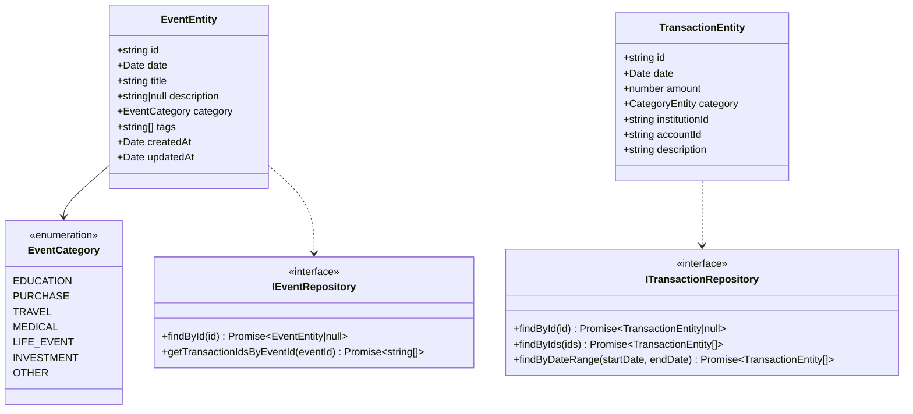
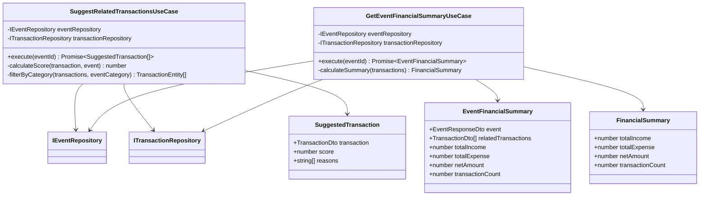
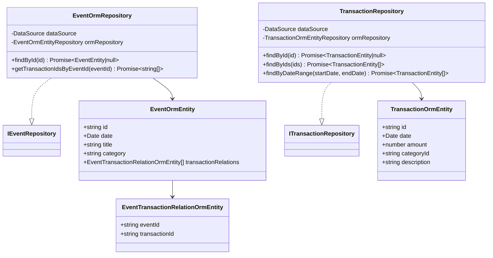
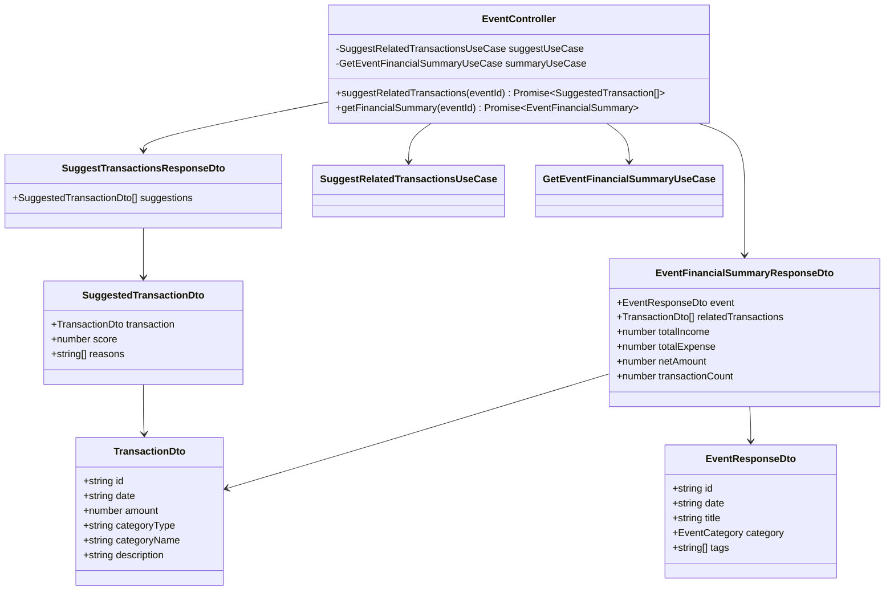
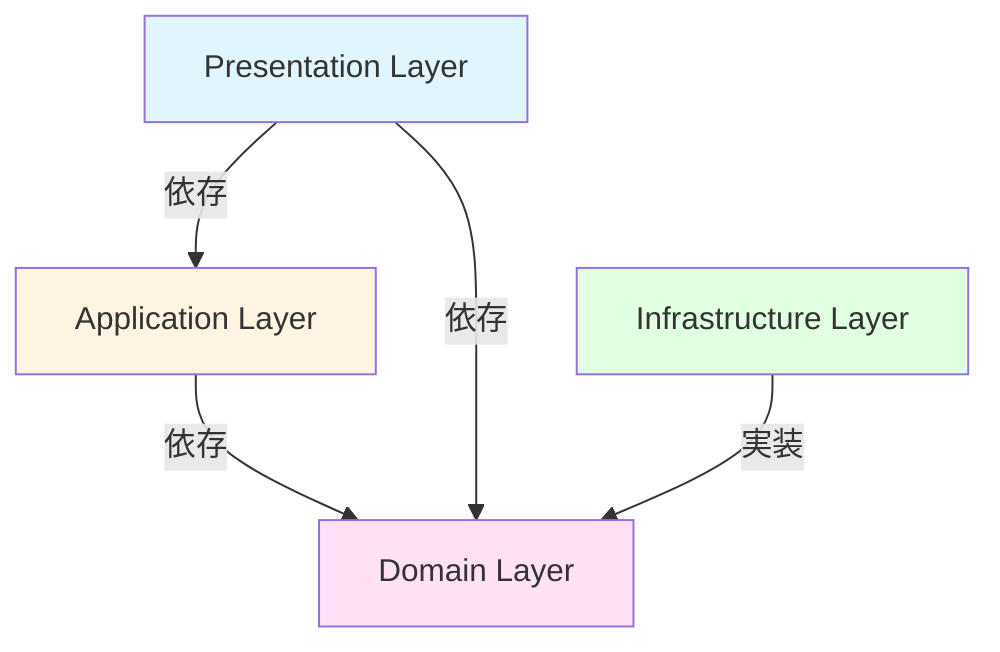
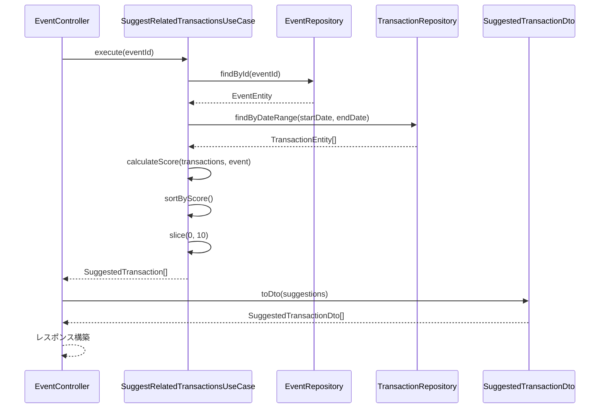

# クラス図

このドキュメントでは、イベントと収支の紐付け機能（FR-022）のクラス構造を記載しています。

## 目次

1. [Domain層クラス図](#domain層クラス図)
2. [Application層クラス図](#application層クラス図)
3. [Infrastructure層クラス図](#infrastructure層クラス図)
4. [Presentation層クラス図](#presentation層クラス図)

---

## Domain層クラス図

### Event & Transaction Entities

**クラス説明**:

#### EventEntity

- **責務**: イベントのドメインエンティティ
- **注意**: FR-021で既に実装済み

#### TransactionEntity

- **責務**: 取引のドメインエンティティ
- **注意**: 既存のTransactionモジュールで実装済み

---

## Application層クラス図

### Use Cases

**クラス説明**:

#### SuggestRelatedTransactionsUseCase

- **責務**: イベントに関連する取引を推奨するユースケース
- **依存**: `IEventRepository`, `ITransactionRepository`
- **入力**: `eventId: string`
- **出力**: `SuggestedTransaction[]`
- **処理**:
  1. イベント情報を取得
  2. イベント日付の前後7日間の取引を取得
  3. イベントカテゴリに応じたフィルタリング
  4. スコアリング（日付の近さ、金額の大きさ、カテゴリマッチ）
  5. 上位10件を返却

#### GetEventFinancialSummaryUseCase

- **責務**: イベント別収支サマリーを取得するユースケース
- **依存**: `IEventRepository`, `ITransactionRepository`
- **入力**: `eventId: string`
- **出力**: `EventFinancialSummary`
- **処理**:
  1. イベント情報を取得
  2. イベントに関連付けられた取引ID一覧を取得
  3. 取引エンティティを取得
  4. 収支を集計（総収入、総支出、純収支、取引件数）
  5. サマリーを構築して返却

#### SuggestedTransaction

- **責務**: 推奨取引のDTO
- **フィールド**:
  - `transaction`: 取引情報
  - `score`: 推奨スコア（0-100）
  - `reasons`: 推奨理由の配列

#### EventFinancialSummary

- **責務**: イベント別収支サマリーのDTO
- **フィールド**:
  - `event`: イベント情報
  - `relatedTransactions`: 関連取引一覧
  - `totalIncome`: 総収入
  - `totalExpense`: 総支出
  - `netAmount`: 純収支
  - `transactionCount`: 取引件数

---

## Infrastructure層クラス図

### Repository Implementations

**クラス説明**:

#### EventOrmRepository

- **責務**: イベントリポジトリの実装（TypeORM）
- **注意**: FR-021で既に実装済み

#### TransactionRepository

- **責務**: 取引リポジトリの実装（TypeORM）
- **注意**: 既存のTransactionモジュールで実装済み

---

## Presentation層クラス図

### Controllers

**クラス説明**:

#### EventController

- **責務**: イベントAPIのコントローラー
- **エンドポイント**:
  - `GET /api/events/:id/suggest-transactions`: 関連取引の推奨取得
  - `GET /api/events/:id/financial-summary`: イベント別収支サマリー取得
- **注意**: FR-021で既に実装されている`EventController`に追加

#### SuggestTransactionsResponseDto

- **責務**: 推奨取引レスポンスのDTO
- **フィールド**:
  - `suggestions`: 推奨取引の配列

#### EventFinancialSummaryResponseDto

- **責務**: イベント別収支サマリーレスポンスのDTO
- **フィールド**: `EventFinancialSummary`と同じ

---

## クラス間の関係性

### 依存関係の概要

**注意**: Presentation層からDomain層への依存（`A -->|依存| C`）は、`EventResponseDto`が`EventCategory` enumを直接利用しているためです。これは実用的な判断ですが、厳密なOnion Architecture原則からは少し逸脱します。

### データフロー

---

## 実装上の注意点

### 型安全性

- すべてのクラスとメソッドに適切な型定義を行う
- `any`型の使用を避ける
- Genericsを活用して型の再利用性を高める
- Enum型の比較は型安全に（`Object.entries()`使用時は明示的型キャスト）

### 依存性注入

- コンストラクタインジェクションを使用
- インターフェースに依存し、実装に依存しない
- NestJSのDIコンテナを活用

### スコアリングロジック

- スコアリングロジックはApplication層のUseCaseに実装
- スコアの計算式は明確に定義し、テスト可能にする
- 将来的に機械学習モデルを導入する場合も、インターフェースを抽象化して差し替え可能にする

### エラーハンドリング

- カスタム例外クラスを定義（`EventNotFoundException`等）
- 適切なエラーメッセージを提供
- エラーのロギング

### Onion Architecture原則

- Domain層のEntityは、Presentation層のDTO型に依存してはならない
- EntityからDTOへの変換は、Application層のUseCaseまたはPresentation層のマッパーで実施
- `toJSON()`メソッドでDTOを返すのは違反

---

## チェックリスト

クラス図作成時の確認事項：

### Domain層

- [x] すべてのEntityが定義されている
- [x] Repositoryインターフェースが定義されている
- [x] 既存のEntityを再利用している

### Application層

- [x] すべてのUseCaseが定義されている
- [x] DTOが適切に定義されている
- [x] スコアリングロジックが明確

### Infrastructure層

- [x] Repositoryの実装クラスが定義されている
- [x] 既存のRepositoryを再利用している

### Presentation層

- [x] すべてのControllerが定義されている
- [x] RequestDTO、ResponseDTOが定義されている
- [x] エンドポイントが明確
