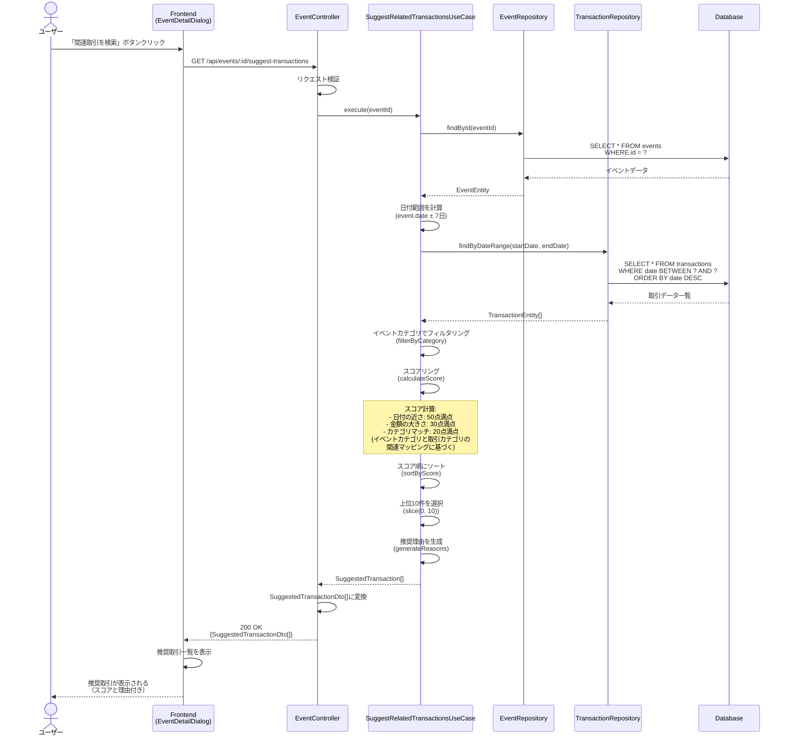
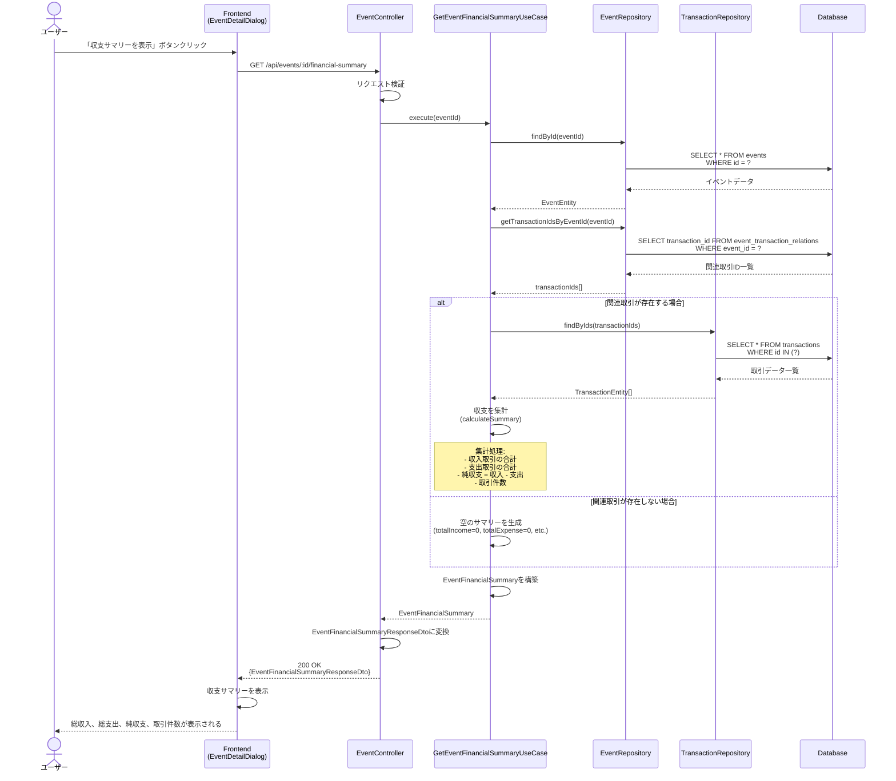
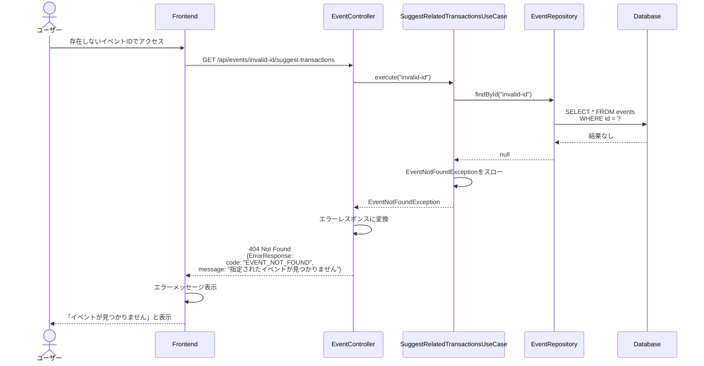
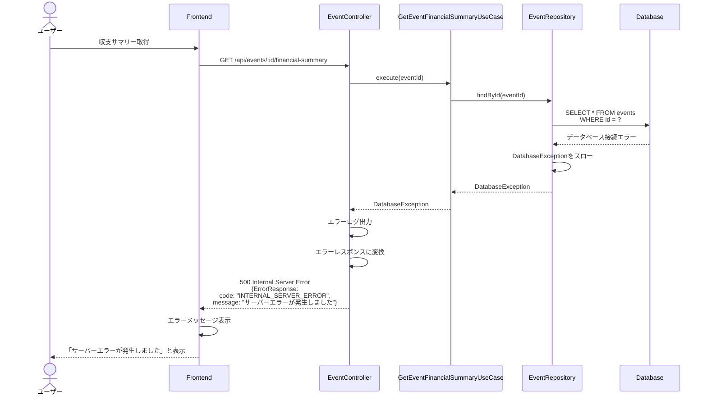

# シーケンス図

このドキュメントでは、イベントと収支の紐付け機能（FR-022）の処理フローをシーケンス図で記載しています。

## 目次

1. [関連取引の推奨取得のフロー](#関連取引の推奨取得のフロー)
2. [イベント別収支サマリー取得のフロー](#イベント別収支サマリー取得のフロー)
3. [エラーハンドリングフロー](#エラーハンドリングフロー)

---

## 関連取引の推奨取得のフロー

### 概要

**ユースケース**: イベントに関連する可能性のある取引を自動的に推奨する

**アクター**: ユーザー

**前提条件**:

- イベントが存在する
- ユーザーがイベント詳細画面にアクセスしている

**成功時の結果**:

- 推奨取引一覧が表示される
- 各取引に推奨スコアと理由が表示される

### 正常系フロー



### ステップ詳細

1. **ユーザーアクション**
   - イベント詳細画面で「関連取引を検索」ボタンをクリック

2. **API リクエスト**
   - エンドポイント: `GET /api/events/:id/suggest-transactions`
   - Path Parameter: `id` (イベントID)

3. **UseCase 実行**
   - イベント情報を取得
   - イベント日付の前後7日間の取引を取得
   - イベントカテゴリに応じたフィルタリング
   - スコアリング（日付の近さ、金額の大きさ、カテゴリマッチ）
   - スコア順にソート
   - 上位10件を選択
   - 推奨理由を生成

4. **スコアリングロジック**
   - **日付の近さ** (50点満点): イベント日付に近いほど高スコア
     - 0日差: 50点
     - 1日差: 45点
     - 2日差: 40点
     - 3日差: 35点
     - 4日差: 30点
     - 5日差: 25点
     - 6日差: 20点
     - 7日差: 15点
   - **金額の大きさ** (30点満点): 高額取引ほど高スコア
     - 10万円以上: 30点
     - 5万円以上: 25点
     - 3万円以上: 20点
     - 1万円以上: 15点
     - 5千円以上: 10点
     - それ以下: 5点
   - **カテゴリマッチ** (20点満点): イベントカテゴリと取引カテゴリの関連性
     - 完全一致: 20点（イベントカテゴリと取引カテゴリが完全に一致する場合）
     - 関連カテゴリ: 15点（以下のマッピングに該当する場合）
       - `TRAVEL` → 交通費、宿泊費、飲食費、娯楽費
       - `EDUCATION` → 教育費、書籍費、文具費
       - `PURCHASE` → 家具・家電、自動車、住宅関連
       - `MEDICAL` → 医療費、薬代、健康診断費
       - `LIFE_EVENT` → 結婚式、出産、引越し関連費
       - `INVESTMENT` → 投資関連、証券関連
     - その他: 5点（`OTHER`イベントカテゴリ、またはマッピングに該当しない場合）

5. **レスポンス**
   - ResponseDTO: `SuggestedTransactionDto[]`
   - HTTPステータス: 200 OK

---

## イベント別収支サマリー取得のフロー

### 概要

**ユースケース**: イベントに関連付けられた取引の収支を集計する

**アクター**: ユーザー

**前提条件**:

- イベントが存在する
- ユーザーがイベント詳細画面にアクセスしている

**成功時の結果**:

- イベント別収支サマリーが表示される
- 総収入、総支出、純収支、取引件数が表示される

### 正常系フロー



### ステップ詳細

1. **ユーザーアクション**
   - イベント詳細画面で「収支サマリーを表示」ボタンをクリック

2. **API リクエスト**
   - エンドポイント: `GET /api/events/:id/financial-summary`
   - Path Parameter: `id` (イベントID)

3. **UseCase 実行**
   - イベント情報を取得
   - イベントに関連付けられた取引ID一覧を取得
   - 取引エンティティを取得
   - 収支を集計
     - 収入取引（CategoryType.INCOME）の合計
     - 支出取引（CategoryType.EXPENSE）の合計
     - 純収支 = 総収入 - 総支出
     - 取引件数

4. **集計ロジック**
   - 取引を`CategoryType`で分類
   - 収入取引の`amount`を合計
   - 支出取引の`amount`の絶対値を合計
   - 純収支 = 総収入 - 総支出

5. **レスポンス**
   - ResponseDTO: `EventFinancialSummaryResponseDto`
   - HTTPステータス: 200 OK

---

## エラーハンドリングフロー

### リソース未検出エラー (404 Not Found)



### サーバーエラー (500 Internal Server Error)



---

## エラーレスポンス形式

すべてのエラーレスポンスは、プロジェクトで定義されている標準形式（`libs/types/src/api/error-response.ts`）に従う：

```typescript
export interface ErrorResponse {
  success: false;
  error: {
    code: string;
    message: string;
    details?: ErrorDetail[];
  };
  metadata: {
    timestamp: string;
    version: string;
  };
}
```

### エラーコード一覧

| エラーコード            | HTTPステータス | 説明                   |
| ----------------------- | -------------- | ---------------------- |
| `EVENT_NOT_FOUND`       | 404            | イベントが見つからない |
| `INTERNAL_SERVER_ERROR` | 500            | サーバー内部エラー     |

---

## パフォーマンス考慮事項

### 推奨取引取得

- 日付範囲クエリはインデックスを活用（`date`カラムにインデックス）
- スコアリング処理はメモリ内で実行（データベース負荷を最小化）
- 推奨件数を10件に制限（レスポンスサイズを制御）

### 収支サマリー取得

- 関連取引ID一覧の取得は1回のクエリで実行
- 取引エンティティの取得は`IN`句を使用（N+1問題を回避）
- 集計処理はメモリ内で実行（データベース負荷を最小化）
