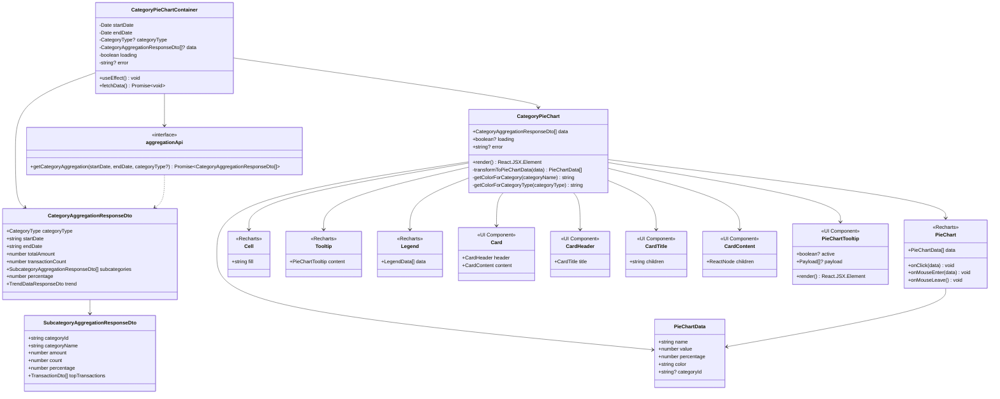

# クラス図

このドキュメントでは、カテゴリ別円グラフ表示機能のクラス構造を記載しています。

## 目次

1. [Frontend層クラス図](#frontend層クラス図)

---

## Frontend層クラス図

### Category Pie Chart Module (FR-025)

**クラス説明**:

#### CategoryPieChartContainer（新規作成）

- **責務**: データ取得と状態管理を行うコンテナコンポーネント
- **主要プロパティ**:
  - `startDate: Date`: 集計開始日
  - `endDate: Date`: 集計終了日
  - `categoryType?: CategoryType`: カテゴリタイプ（オプション、指定しない場合は全カテゴリ）
  - `data?: CategoryAggregationResponseDto[]`: 取得した集計データ
  - `loading: boolean`: ローディング状態
  - `error?: string`: エラーメッセージ
- **主要メソッド**:
  - `useEffect()`: データ取得のトリガー
  - `fetchData()`: APIからデータを取得

#### CategoryPieChart（新規作成）

- **責務**: 円グラフの描画とインタラクション処理
- **主要プロパティ**:
  - `data: CategoryAggregationResponseDto[]`: 表示する集計データ
  - `loading?: boolean`: ローディング状態
  - `error?: string | null`: エラーメッセージ
- **主要メソッド**:
  - `render()`: コンポーネントの描画
  - `transformToPieChartData(data)`: APIレスポンスをグラフ用データに変換
  - `getColorForCategory(categoryName)`: カテゴリ名に応じた色を取得
  - `getColorForCategoryType(categoryType)`: カテゴリタイプに応じた色を取得

#### PieChartData（Value Object）

- **責務**: 円グラフのセグメントデータを表現
- **不変性**: 値オブジェクトは不変（immutable）

#### aggregationApi（既存）

- **責務**: カテゴリ別集計APIのクライアント
- **主要メソッド**:
  - `getCategoryAggregation(startDate, endDate, categoryType?)`: カテゴリ別集計データを取得

#### CategoryAggregationResponseDto（既存 - FR-018）

- **責務**: カテゴリ別集計のレスポンスDTO
- **参照**: [FR-018 入出力設計](../FR-018_category-aggregation/input-output-design.md)

#### SubcategoryAggregationResponseDto（既存 - FR-018）

- **責務**: サブカテゴリ別集計のレスポンスDTO
- **参照**: [FR-018 入出力設計](../FR-018_category-aggregation/input-output-design.md)

#### PieChart, Cell, Tooltip, Legend（Recharts）

- **責務**: Rechartsライブラリのコンポーネント
- **参照**: [Recharts公式ドキュメント](https://recharts.org/)

#### Card, CardHeader, CardTitle, CardContent（既存UIコンポーネント）

- **責務**: UIコンポーネント（既存）
- **参照**: 既存の`apps/frontend/src/components/ui/Card.tsx`

#### PieChartTooltip（新規 - CategoryPieChart内で定義）

- **責務**: カスタムツールチップコンポーネント（円グラフ用）
- **参照**: `apps/frontend/src/components/dashboard/CategoryPieChart.tsx`内で定義

---

## チェックリスト

クラス図作成時の確認事項：

### 必須項目

- [x] Frontend層のクラス図が記載されている
- [x] 各クラスの責務が説明されている
- [x] 主要メソッドが記載されている
- [x] 依存関係が明確に示されている

### 推奨項目

- [x] Value Objectが明示されている
- [x] 既存コンポーネントとの関係が明確
- [x] 外部ライブラリ（Recharts）の使用が明確

### 注意事項

- [x] 既存API（FR-018）との関係が明確
- [x] 既存UIコンポーネントの再利用が明確
- [x] 型安全性が確保されている
