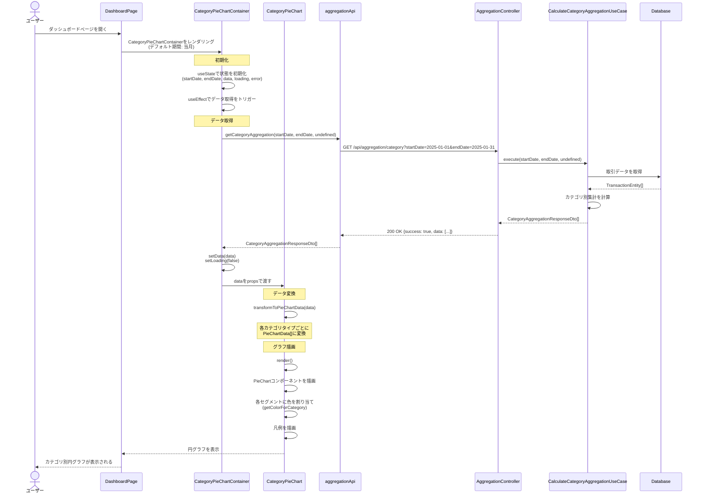
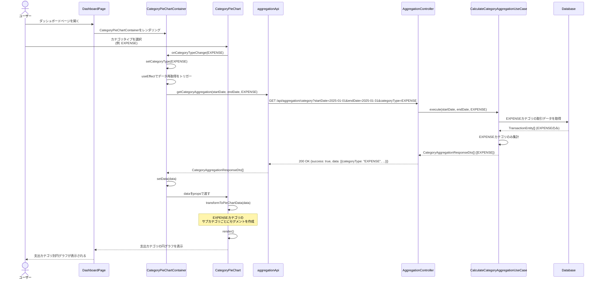
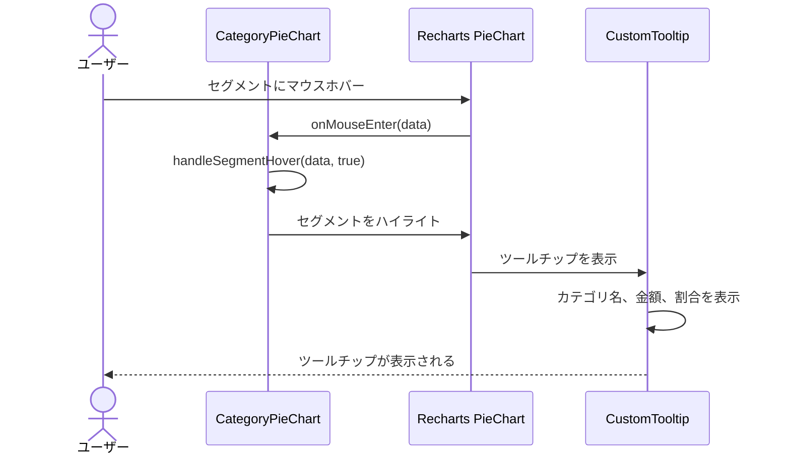
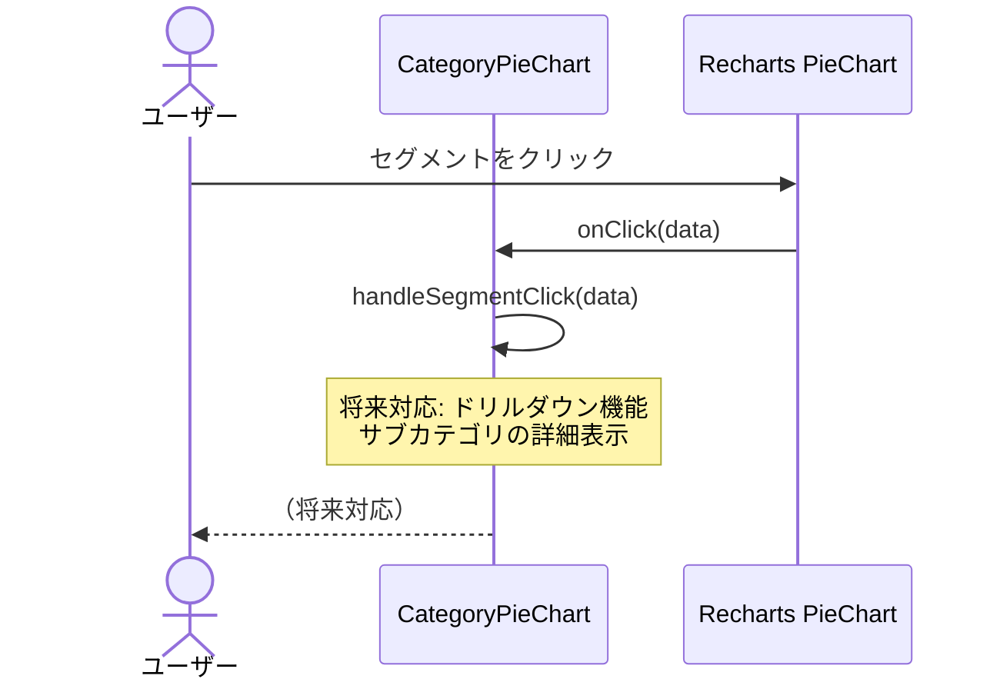
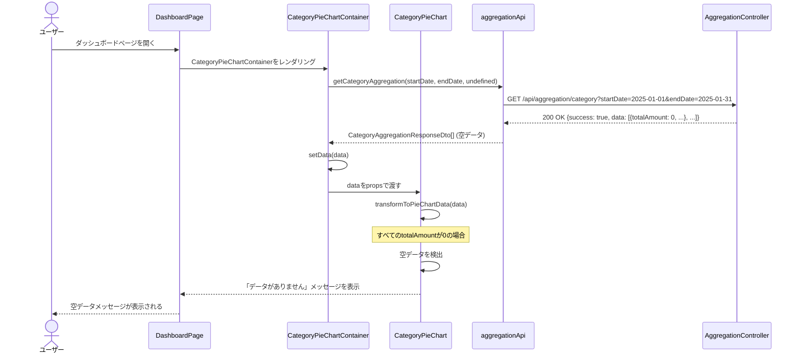
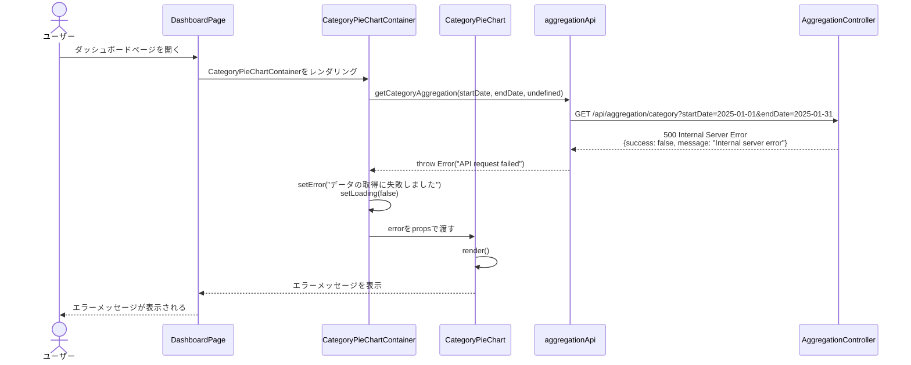
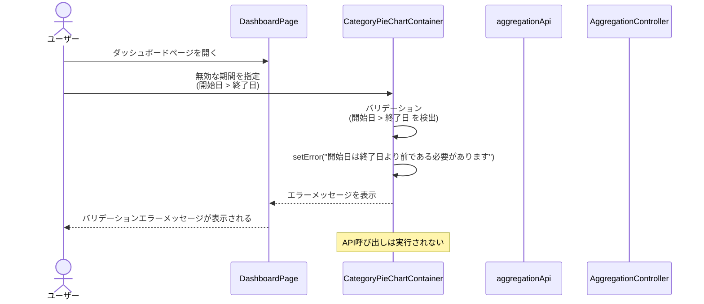

# シーケンス図

このドキュメントでは、カテゴリ別円グラフ表示機能の処理フローをシーケンス図で記載しています。

## 目次

1. [カテゴリ別円グラフ表示のフロー](#カテゴリ別円グラフ表示のフロー)
2. [エラーハンドリングフロー](#エラーハンドリングフロー)

---

## カテゴリ別円グラフ表示のフロー

### 概要

**ユースケース**: 指定した期間のカテゴリ別集計データを円グラフ（ドーナツチャート）で表示する

**アクター**: ユーザー

**前提条件**:

- ダッシュボードページが表示されている
- 既存のFR-018 APIが利用可能

**成功時の結果**:

- カテゴリ別円グラフが表示される
- 凡例が表示される
- インタラクティブな操作（ホバー、クリック）が可能

### 正常系フロー（全カテゴリ表示）

### 正常系フロー（特定カテゴリのみ表示）

### インタラクションフロー（ホバー）

### インタラクションフロー（クリック - 将来対応）

### ステップ詳細

1. **ユーザーアクション**
   - ユーザーがダッシュボードページを開く
   - デフォルトで当月のデータが表示される

2. **Container 初期化**
   - `CategoryPieChartContainer`がマウントされる
   - デフォルト期間（当月）を設定
   - `useEffect`でデータ取得をトリガー

3. **データ取得**
   - `aggregationApi.getCategoryAggregation()`を呼び出し
   - 既存のFR-018 APIエンドポイントを使用
   - レスポンスを`CategoryAggregationResponseDto[]`として受け取る

4. **データ変換**
   - `transformToPieChartData()`でAPIレスポンスをグラフ用データに変換
   - 各カテゴリタイプごとにセグメントを作成
   - 色を割り当て（`getColorForCategory()`）

5. **グラフ描画**
   - Rechartsの`PieChart`コンポーネントを使用
   - 各セグメントを`Cell`コンポーネントで描画
   - `Tooltip`と`Legend`を表示

6. **インタラクション**
   - ホバー時: ツールチップを表示
   - クリック時: 将来対応（ドリルダウン機能）

### データが存在しない場合のフロー

**重要**: データが存在しない場合でも、エラーではなく空データメッセージを表示する。これは正常なシナリオの一つとして扱う。

---

## エラーハンドリングフロー

### APIエラー（500 Internal Server Error）

### バリデーションエラー（400 Bad Request）

### エラーハンドリング実装

- **APIエラー**: `try-catch`でエラーをキャッチし、エラーメッセージを表示
- **バリデーションエラー**: フロントエンドで事前にバリデーションを実行
- **ローディング状態**: データ取得中はローディングインジケーターを表示
- **リトライ機能**: 将来対応（必要に応じて実装）

---

## チェックリスト

シーケンス図作成時の確認事項：

### 必須項目

- [x] 正常系フローが記載されている
- [x] 異常系フローが記載されている
- [x] 各ステップの説明が記載されている
- [x] エラーハンドリングが明確に示されている
- [x] データが存在しない場合の処理が明確

### 推奨項目

- [x] 前提条件が記載されている
- [x] 成功時の結果が記載されている
- [x] インタラクションフローが明確

### 注意事項

- [x] 既存API（FR-018）との関係が明確
- [x] 空データは正常な応答として扱う（エラーにしない）
- [x] エラーハンドリングが適切に実装されている
