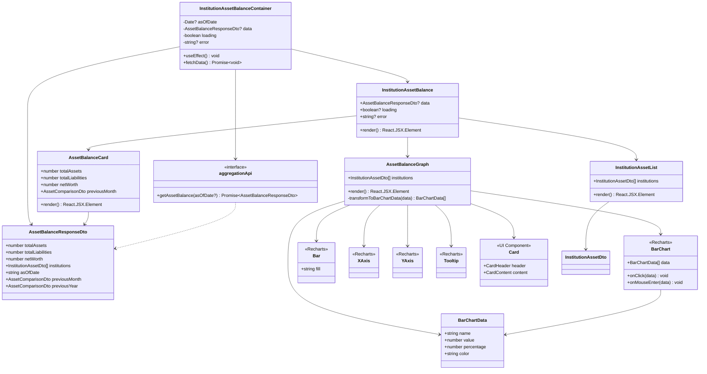

# クラス図

このドキュメントでは、金融機関別資産残高表示機能のクラス構造を記載しています。

## 目次

1. [Domain層クラス図](#domain層クラス図)
2. [Application層クラス図](#application層クラス図)
3. [Infrastructure層クラス図](#infrastructure層クラス図)
4. [Presentation層クラス図](#presentation層クラス図)
5. [Frontend層クラス図](#frontend層クラス図)

---

## Domain層クラス図

### Asset Balance Module (FR-026)

**クラス説明**:

#### InstitutionEntity（既存）

- **責務**: 金融機関情報のエンティティ
- **主要プロパティ**:
  - `accounts`: 配下の口座一覧

#### AccountEntity（既存）

- **責務**: 口座情報のエンティティ
- **主要プロパティ**:
  - `balance`: 現在の残高
- **主要メソッド**:
  - `hasPositiveBalance()`: 残高がプラスかどうか
  - `hasNegativeBalance()`: 残高がマイナスかどうか

#### AssetBalanceDomainService（新規作成）

- **責務**: 資産残高計算のドメインロジック
- **主要メソッド**:
  - `calculateNetWorth(institutions)`: 純資産を計算（資産合計 - 負債合計）
  - `calculatePercentage(institutionTotal, grandTotal)`: 構成比を計算
  - `classifyAssetsAndLiabilities(institutions)`: 資産と負債に分類

#### AssetClassification（Value Object）

- **責務**: 資産と負債の分類結果を表現
- **不変性**: 値オブジェクトは不変（immutable）

---

## Application層クラス図

### Use Cases

**クラス説明**:

#### CalculateAssetBalanceUseCase（新規作成）

- **責務**: 資産残高計算のユースケース実装
- **依存**: `IInstitutionRepository`, `AssetBalanceDomainService`
- **入力**: `asOfDate?: Date`（デフォルト: 今日）
- **出力**: `AssetBalanceResponseDto`
- **主要メソッド**:
  - `execute(asOfDate?)`: 資産残高を計算
  - `buildInstitutionAsset(institution)`: 金融機関別資産情報を構築
  - `buildAccountAsset(account)`: 口座別資産情報を構築
  - `calculateComparison(current, previous)`: 前月比を計算

**注意**: DTOの定義はPresentation層のクラス図を参照してください。Application層では依存関係のみを示します。

---

## Infrastructure層クラス図

### Repositories

**クラス説明**:

#### InstitutionRepository（既存）

- **責務**: 金融機関情報のリポジトリ実装
- **主要メソッド**:
  - `findAll()`: すべての金融機関を取得
  - `findByIds(ids)`: 指定されたIDの金融機関を取得
  - `toDomainEntity(ormEntity)`: ORMエンティティをドメインエンティティに変換

---

## Presentation層クラス図

### Controllers and DTOs

**クラス説明**:

#### AggregationController（既存・拡張）

- **責務**: 集計機能のREST APIエンドポイント
- **主要メソッド**:
  - `getAssetBalance(query)`: 資産残高情報を取得

#### GetAssetBalanceDto（新規作成）

- **責務**: リクエストDTO（class）
- **バリデーション**: `class-validator`デコレーターと`ValidationPipe`で実行

#### AssetBalanceResponseDto（新規作成）

- **責務**: レスポンスDTO（interface）
- **注意**: Onion Architecture原則により、レスポンスDTOは`interface`で定義

#### InstitutionAssetDto（新規作成）

- **責務**: 金融機関別資産情報のDTO

#### AccountAssetDto（新規作成）

- **責務**: 口座別資産情報のDTO

#### AssetComparisonDto（新規作成）

- **責務**: 前月比・前年比の比較情報のDTO

---

## Frontend層クラス図

### Institution Asset Balance Module (FR-026)

**クラス説明**:

#### InstitutionAssetBalanceContainer（新規作成）

- **責務**: データ取得と状態管理を行うコンテナコンポーネント
- **主要プロパティ**:
  - `asOfDate?: Date`: 基準日（デフォルト: 今日）
  - `data?: AssetBalanceResponseDto`: 取得した資産残高データ
  - `loading: boolean`: ローディング状態
  - `error?: string`: エラーメッセージ
- **主要メソッド**:
  - `useEffect()`: データ取得のトリガー
  - `fetchData()`: APIからデータを取得

#### InstitutionAssetBalance（新規作成）

- **責務**: 資産残高表示のメインコンポーネント
- **主要プロパティ**:
  - `data?: AssetBalanceResponseDto`: 表示する資産残高データ
  - `loading?: boolean`: ローディング状態
  - `error?: string | null`: エラーメッセージ
- **主要メソッド**:
  - `render()`: コンポーネントの描画

#### AssetBalanceCard（新規作成）

- **責務**: 総資産カードの表示
- **主要プロパティ**:
  - `totalAssets: number`: 総資産
  - `totalLiabilities: number`: 総負債
  - `netWorth: number`: 純資産
  - `previousMonth: AssetComparisonDto`: 前月比

#### InstitutionAssetList（新規作成）

- **責務**: 金融機関別リストの表示
- **主要プロパティ**:
  - `institutions: InstitutionAssetDto[]`: 金融機関別資産情報

#### AssetBalanceGraph（新規作成）

- **責務**: 資産構成グラフ（横棒グラフ）の描画
- **主要プロパティ**:
  - `institutions: InstitutionAssetDto[]`: 金融機関別資産情報
- **主要メソッド**:
  - `transformToBarChartData(data)`: APIレスポンスをグラフ用データに変換

#### BarChartData（Value Object）

- **責務**: 横棒グラフのデータを表現
- **不変性**: 値オブジェクトは不変（immutable）

#### aggregationApi（既存・拡張）

- **責務**: 集計APIのクライアント
- **主要メソッド**:
  - `getAssetBalance(asOfDate?)`: 資産残高データを取得

#### BarChart, Bar, XAxis, YAxis, Tooltip（Recharts）

- **責務**: Rechartsライブラリのコンポーネント
- **参照**: [Recharts公式ドキュメント](https://recharts.org/)

#### Card（既存UIコンポーネント）

- **責務**: UIコンポーネント（既存）
- **参照**: 既存の`apps/frontend/src/components/ui/Card.tsx`

---

## チェックリスト

クラス図作成時の確認事項：

### 必須項目

- [x] Domain層のクラス図が記載されている
- [x] Application層のクラス図が記載されている
- [x] Infrastructure層のクラス図が記載されている
- [x] Presentation層のクラス図が記載されている
- [x] Frontend層のクラス図が記載されている
- [x] 各クラスの責務が説明されている
- [x] 主要メソッドが記載されている
- [x] 依存関係が明確に示されている

### 推奨項目

- [x] Value Objectが明示されている
- [x] 既存コンポーネントとの関係が明確
- [x] 外部ライブラリ（Recharts）の使用が明確

### 注意事項

- [x] 既存エンティティ（InstitutionEntity, AccountEntity）の再利用が明確
- [x] Onion Architecture原則に従っている（DTOはinterface、リクエストDTOはclass）
- [x] 型安全性が確保されている
