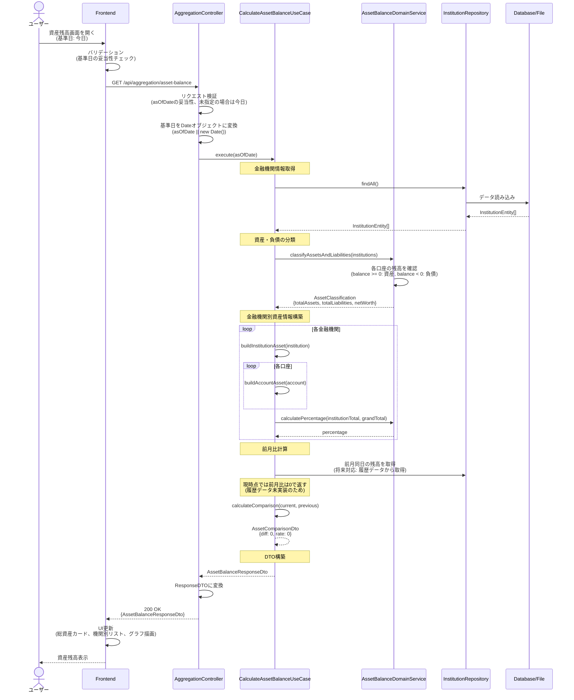
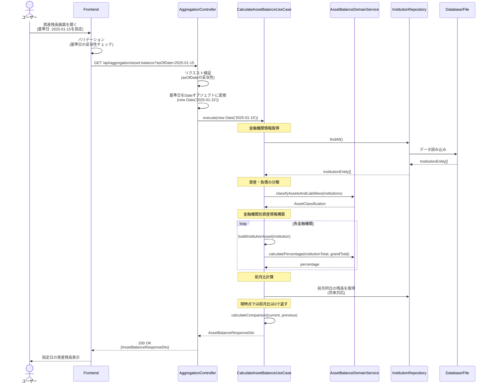
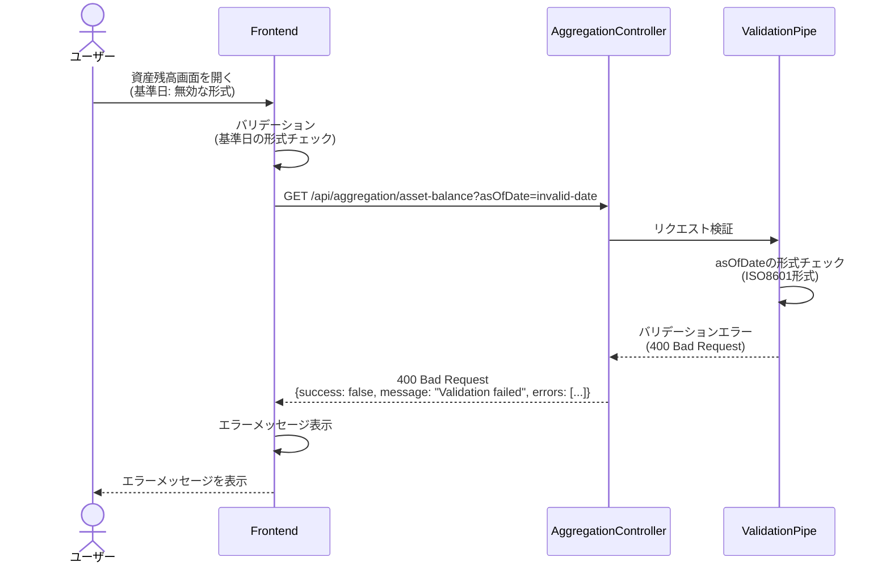
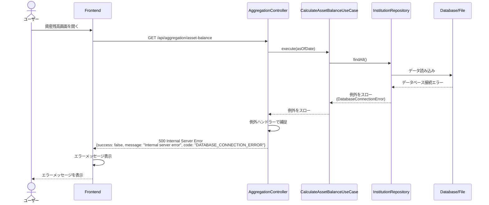
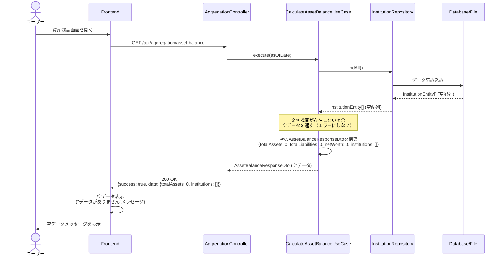

# シーケンス図

このドキュメントでは、金融機関別資産残高表示機能の処理フローをシーケンス図で記載しています。

## 目次

1. [資産残高取得のフロー](#資産残高取得のフロー)
2. [エラーハンドリングフロー](#エラーハンドリングフロー)

---

## 資産残高取得のフロー

### 概要

**ユースケース**: 各金融機関の現在残高を集計し、総資産や機関別の構成比を取得する

**アクター**: ユーザー（フロントエンド経由）

**前提条件**:

- 金融機関情報が存在する（データが存在しない場合は空データを返す）
- 口座情報が存在する

**成功時の結果**:

- 資産残高情報が取得される
- 金融機関別の内訳が取得される
- 前月比の増減が取得される

### 正常系フロー（基準日: 今日）

### 正常系フロー（基準日: 指定日）

### ステップ詳細

1. **ユーザーアクション**
   - ユーザーが資産残高画面を開く
   - 基準日を選択（デフォルト: 今日）

2. **Frontend バリデーション**
   - 基準日の形式チェック（ISO8601形式）
   - 基準日の妥当性チェック（未来日でないか）

3. **API リクエスト**
   - エンドポイント: `GET /api/aggregation/asset-balance`
   - クエリパラメータ: `asOfDate` (string, オプション、デフォルト: 今日)

4. **Use Case 実行**
   - すべての金融機関情報を取得
   - 各口座の残高を集計
   - 資産と負債に分類
   - 純資産を計算
   - 構成比を計算
   - 前月比を計算（将来対応: 履歴データから取得）

5. **DTO構築**
   - `AssetBalanceResponseDto`を構築
   - 金融機関別資産情報を構築
   - 口座別資産情報を構築

6. **レスポンス**
   - 200 OKでレスポンスを返す
   - データが存在しない場合は空配列を返す（500エラーにしない）

---

## エラーハンドリングフロー

### バリデーションエラー（400 Bad Request）

### サーバーエラー（500 Internal Server Error）

### データ未検出（200 OK with empty data）

**重要**: 金融機関が存在しない場合でも、500エラーではなく200 OKで空データを返す。これは正常なシナリオの一つとして扱う。

---

## チェックリスト

シーケンス図作成時の確認事項：

### 必須項目

- [x] 正常系フローが記載されている
- [x] エラーハンドリングフローが記載されている
- [x] 各ステップの説明が明確
- [x] アクターと参加者が明確

### 推奨項目

- [x] 複数のシナリオ（基準日指定/未指定）が記載されている
- [x] エラーレスポンス形式が明確
- [x] データ未検出時の処理が明確（200 OKで空データを返す）

### 注意事項

- [x] エラーハンドリングが適切に実装されている
- [x] 空データは正常な応答として扱う（500エラーにしない）
- [x] 前月比計算は将来対応として明記（履歴データ未実装のため）
