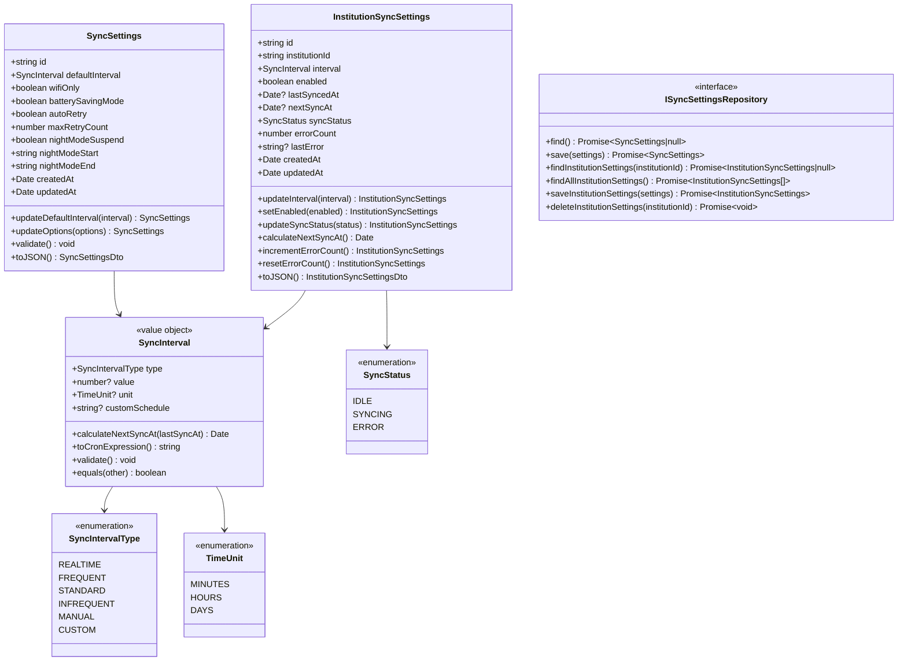

# クラス図

このドキュメントでは、データ同期間隔設定機能のクラス構造を記載しています。

## 目次

1. [Domain層クラス図](#domain層クラス図)
2. [Application層クラス図](#application層クラス図)
3. [Infrastructure層クラス図](#infrastructure層クラス図)
4. [Presentation層クラス図](#presentation層クラス図)

---

## Domain層クラス図

### Sync Settings Module

**クラス説明**:

#### SyncSettings

- **責務**: 全体の同期設定の管理、バリデーション
- **主要メソッド**:
  - `updateDefaultInterval(interval)`: デフォルト同期間隔を更新（新しいインスタンスを返す）
  - `updateOptions(options)`: 詳細オプションを更新（新しいインスタンスを返す）
  - `validate()`: 設定値のバリデーション（夜間モード時刻の妥当性チェック等）
  - `toJSON()`: JSON形式への変換（APIレスポンス用）

#### SyncInterval

- **責務**: 同期間隔の値オブジェクト、次回同期時刻の計算、Cron式への変換
- **不変性**: 値オブジェクトは不変（immutable）
- **主要メソッド**:
  - `calculateNextSyncAt(lastSyncAt)`: 最終同期日時から次回同期時刻を計算
  - `toCronExpression()`: Cron式に変換（ScheduledSyncJob用）
  - `validate()`: 同期間隔の範囲チェック（5分〜30日）
  - `equals(other)`: 等価性の判定

#### SyncIntervalType

- **責務**: 同期間隔タイプの定義
- **値**:
  - `REALTIME`: リアルタイム（5分ごと）
  - `FREQUENT`: 高頻度（1時間ごと）
  - `STANDARD`: 標準（6時間ごと）
  - `INFREQUENT`: 低頻度（1日1回）
  - `MANUAL`: 手動のみ
  - `CUSTOM`: カスタム間隔

#### TimeUnit

- **責務**: 時間単位の定義
- **値**:
  - `MINUTES`: 分
  - `HOURS`: 時間
  - `DAYS`: 日

#### InstitutionSyncSettings

- **責務**: 金融機関ごとの同期設定の管理、同期ステータスの管理
- **主要メソッド**:
  - `updateInterval(interval)`: 同期間隔を更新（新しいインスタンスを返す）
  - `setEnabled(enabled)`: 有効/無効を設定（新しいインスタンスを返す）
  - `updateSyncStatus(status)`: 同期ステータスを更新（新しいインスタンスを返す）
  - `calculateNextSyncAt()`: 次回同期時刻を計算
  - `incrementErrorCount()`: エラー回数を増加（新しいインスタンスを返す）
  - `resetErrorCount()`: エラー回数をリセット（新しいインスタンスを返す）
  - `toJSON()`: JSON形式への変換（APIレスポンス用）

#### SyncStatus

- **責務**: 同期ステータスの定義
- **値**:
  - `IDLE`: 待機中
  - `SYNCING`: 同期中
  - `ERROR`: エラー

---

## Application層クラス図

### Use Cases

```mermaid
classDiagram
    class GetSyncSettingsUseCase {
        -ISyncSettingsRepository repository
        +execute() Promise~SyncSettingsDto~
    }

    class UpdateSyncSettingsUseCase {
        -ISyncSettingsRepository repository
        -ScheduledSyncJob scheduler
        +execute(dto) Promise~SyncSettingsDto~
        -updateSchedule(settings) void
    }

    class GetInstitutionSyncSettingsUseCase {
        -ISyncSettingsRepository repository
        +execute(institutionId?) Promise~InstitutionSyncSettingsDto[]~
    }

    class UpdateInstitutionSyncSettingsUseCase {
        -ISyncSettingsRepository repository
        -ScheduledSyncJob scheduler
        +execute(institutionId, dto) Promise~InstitutionSyncSettingsDto~
        -updateSchedule(institutionId, settings) void
    }

    class SyncSettingsDto {
        <<interface>>
        +SyncIntervalDto defaultInterval
        +boolean wifiOnly
        +boolean batterySavingMode
        +boolean autoRetry
        +number maxRetryCount
        +boolean nightModeSuspend
        +string nightModeStart
        +string nightModeEnd
    }

    class SyncIntervalDto {
        <<interface>>
        +string type
        +number? value
        +string? unit
        +string? customSchedule
    }

    class InstitutionSyncSettingsDto {
        <<interface>>
        +string id
        +string institutionId
        +SyncIntervalDto interval
        +boolean enabled
        +string? lastSyncedAt
        +string? nextSyncAt
        +string syncStatus
        +number errorCount
        +string? lastError
    }

    GetSyncSettingsUseCase --> ISyncSettingsRepository
    UpdateSyncSettingsUseCase --> ISyncSettingsRepository
    UpdateSyncSettingsUseCase --> ScheduledSyncJob
    GetInstitutionSyncSettingsUseCase --> ISyncSettingsRepository
    UpdateInstitutionSyncSettingsUseCase --> ISyncSettingsRepository
    UpdateInstitutionSyncSettingsUseCase --> ScheduledSyncJob
```

**クラス説明**:

#### GetSyncSettingsUseCase

- **責務**: 全体設定の取得
- **主要メソッド**:
  - `execute()`: 現在の設定を取得し、DTOに変換して返却

#### UpdateSyncSettingsUseCase

- **責務**: 全体設定の更新、スケジュールの動的更新
- **主要メソッド**:
  - `execute(dto)`: 設定を更新し、スケジュールを更新
  - `updateSchedule(settings)`: ScheduledSyncJobのスケジュールを更新

#### GetInstitutionSyncSettingsUseCase

- **責務**: 金融機関ごとの設定取得
- **主要メソッド**:
  - `execute(institutionId?)`: 指定された金融機関の設定を取得（institutionIdが未指定の場合は全件取得）

#### UpdateInstitutionSyncSettingsUseCase

- **責務**: 金融機関ごとの設定更新、スケジュールの動的更新
- **主要メソッド**:
  - `execute(institutionId, dto)`: 設定を更新し、スケジュールを更新
  - `updateSchedule(institutionId, settings)`: 特定金融機関のスケジュールを更新

---

## Infrastructure層クラス図

### Repository Implementation

**クラス説明**:

#### SyncSettingsRepositoryImpl

- **責務**: 同期設定の永続化（JSONファイルまたはDB）
- **主要メソッド**:
  - `find()`: 全体設定を読み込み
  - `save(settings)`: 全体設定を保存
  - `findInstitutionSettings(institutionId)`: 特定金融機関の設定を取得
  - `findAllInstitutionSettings()`: 全金融機関の設定を取得
  - `saveInstitutionSettings(settings)`: 金融機関設定を保存
  - `deleteInstitutionSettings(institutionId)`: 金融機関設定を削除

#### ScheduledSyncJob

- **責務**: 動的スケジュール更新（既存のScheduledSyncJobを拡張）
- **主要メソッド**:
  - `updateSchedule(cronExpression)`: 全体のスケジュールを更新
  - `updateInstitutionSchedule(institutionId, cronExpression)`: 特定金融機関のスケジュールを更新

---

## Presentation層クラス図

### Controllers and DTOs

**クラス説明**:

#### SyncSettingsController

- **責務**: HTTP リクエスト/レスポンスの処理、バリデーション
- **主要メソッド**:
  - `getSettings()`: 全体設定を取得
  - `updateSettings(dto)`: 全体設定を更新
  - `getInstitutionSettings(institutionId?)`: 金融機関設定を取得
  - `updateInstitutionSettings(institutionId, dto)`: 金融機関設定を更新

---

## チェックリスト

設計書作成時の確認事項：

### 必須項目

- [x] Domain層のクラスが定義されている
- [x] Application層のUseCaseが定義されている
- [x] Infrastructure層のRepository実装が定義されている
- [x] Presentation層のControllerとDTOが定義されている
- [x] クラス間の依存関係が明確になっている

### 推奨項目

- [x] 各クラスの責務が明確に記載されている
- [x] 主要メソッドの説明が記載されている
- [x] 値オブジェクトの不変性が明記されている
