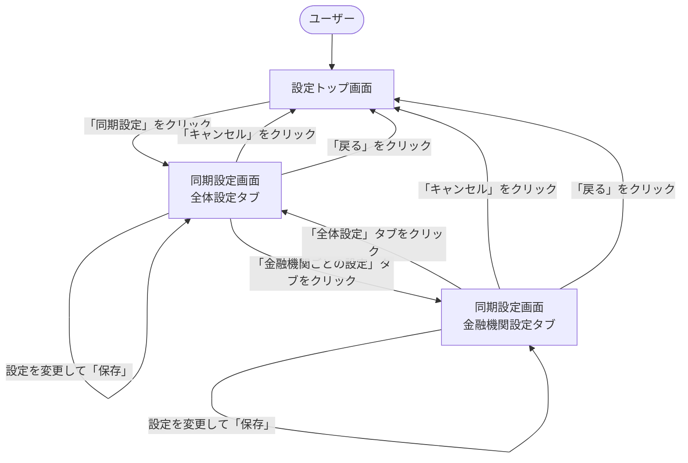

# 画面遷移図

このドキュメントでは、データ同期間隔設定機能の画面遷移とユーザーフローを記載しています。

## 目次

1. [画面一覧](#画面一覧)
2. [画面遷移図](#画面遷移図)
3. [各画面の詳細](#各画面の詳細)

---

## 画面一覧

| 画面ID | 画面名                   | 説明                           |
| ------ | ------------------------ | ------------------------------ |
| S001   | 設定トップ画面           | 設定メニューのトップ画面       |
| S002   | 同期設定画面（全体）     | 全体の同期設定を表示・編集     |
| S003   | 同期設定画面（金融機関） | 金融機関ごとの設定を表示・編集 |

---

## 画面遷移図



---

## 各画面の詳細

### S001: 設定トップ画面

**説明**: 設定メニューのトップ画面。各種設定への入口。

**主要要素**:

- 設定メニュー一覧
  - 金融機関設定
  - **同期設定** ← この機能
  - カテゴリ設定
  - その他

**遷移先**:

- S002: 「同期設定」をクリック

---

### S002: 同期設定画面（全体設定タブ）

**説明**: 全体の同期設定を表示・編集する画面。

**主要要素**:

1. **デフォルト同期間隔**
   - ラジオボタン選択
     - リアルタイム（5分ごと）
     - 高頻度（1時間ごと）
     - 標準（6時間ごと）【推奨】
     - 低頻度（1日1回）
     - 手動のみ
     - カスタム（入力フィールド付き）

2. **詳細オプション**
   - チェックボックス
     - Wi-Fi接続時のみ自動同期する
     - バッテリー節約モード時は同期を控える
     - エラー時は自動リトライする（最大回数: 3）
     - 夜間（22:00-6:00）は同期を停止する
       - 開始時刻入力（HH:mm）
       - 終了時刻入力（HH:mm）

3. **操作ボタン**
   - 「保存」ボタン
   - 「キャンセル」ボタン
   - 「戻る」ボタン

4. **タブ**
   - 「全体設定」タブ（現在選択中）
   - 「金融機関ごとの設定」タブ

**遷移先**:

- S001: 「戻る」または「キャンセル」をクリック
- S003: 「金融機関ごとの設定」タブをクリック
- S002: 「保存」をクリック（成功時は同じ画面に留まり、成功メッセージを表示）

**バリデーション**:

- カスタム間隔の場合、値が5分〜30日の範囲内であること
- 夜間モード有効時、開始時刻と終了時刻が同一でないこと（日付をまたぐ設定は許容）
- 時刻形式がHH:mmであること

**エラーハンドリング**:

- バリデーションエラー: エラーメッセージを表示
- 保存失敗: エラーメッセージを表示

---

### S003: 同期設定画面（金融機関設定タブ）

**説明**: 金融機関ごとの同期設定を表示・編集する画面。

**主要要素**:

1. **金融機関一覧**
   - 各金融機関のカード表示
     - 金融機関名
     - アイコン
     - 現在の同期間隔
     - 最終同期日時
     - 次回同期予定日時
     - 同期ステータス（idle/syncing/error）
     - 「編集」ボタン
     - 「今すぐ同期」ボタン

2. **編集モーダル**（「編集」ボタンクリック時）
   - 同期間隔選択
     - デフォルト設定に従う
     - カスタム設定
       - プリセット選択
       - カスタム間隔入力
   - 有効/無効トグル
   - 「保存」ボタン
   - 「キャンセル」ボタン

3. **操作ボタン**
   - 「戻る」ボタン

4. **タブ**
   - 「全体設定」タブ
   - 「金融機関ごとの設定」タブ（現在選択中）

**遷移先**:

- S001: 「戻る」をクリック
- S002: 「全体設定」タブをクリック
- S003: 「編集」→「保存」をクリック（成功時はモーダルを閉じ、一覧を更新）

**バリデーション**:

- カスタム間隔の場合、値が5分〜30日の範囲内であること

**エラーハンドリング**:

- バリデーションエラー: エラーメッセージを表示
- 保存失敗: エラーメッセージを表示
- 金融機関が見つからない: 404エラーメッセージを表示

---

## ユーザーフロー例

### フロー1: 全体設定の変更

```
1. 設定トップ画面（S001）
   ↓ 「同期設定」をクリック
2. 同期設定画面（全体設定タブ）（S002）
   ↓ 「標準（6時間ごと）」を「高頻度（1時間ごと）」に変更
   ↓ 「保存」をクリック
3. 同期設定画面（全体設定タブ）（S002）
   - 成功メッセージ表示
   - 設定が更新された状態で表示
```

### フロー2: 金融機関ごとの設定変更

```
1. 設定トップ画面（S001）
   ↓ 「同期設定」をクリック
2. 同期設定画面（全体設定タブ）（S002）
   ↓ 「金融機関ごとの設定」タブをクリック
3. 同期設定画面（金融機関設定タブ）（S003）
   ↓ 特定金融機関の「編集」ボタンをクリック
4. 編集モーダル表示
   ↓ 同期間隔を「低頻度（1日1回）」に変更
   ↓ 「保存」をクリック
5. 同期設定画面（金融機関設定タブ）（S003）
   - モーダルを閉じる
   - 成功メッセージ表示
   - 一覧が更新された状態で表示
```

### フロー3: エラー時の処理

```
1. 同期設定画面（全体設定タブ）（S002）
   ↓ カスタム間隔に「1分」と入力（無効な値）
   ↓ 「保存」をクリック
2. 同期設定画面（全体設定タブ）（S002）
   - エラーメッセージ表示
     「5分〜30日の範囲で設定してください」
   - 入力値は保持（修正可能）
```

---

## チェックリスト

設計書作成時の確認事項：

### 必須項目

- [x] 画面一覧が記載されている
- [x] 画面遷移図が記載されている
- [x] 各画面の主要要素が記載されている
- [x] 遷移先が明確になっている

### 推奨項目

- [x] ユーザーフロー例が記載されている
- [x] バリデーションルールが記載されている
- [x] エラーハンドリングが記載されている
