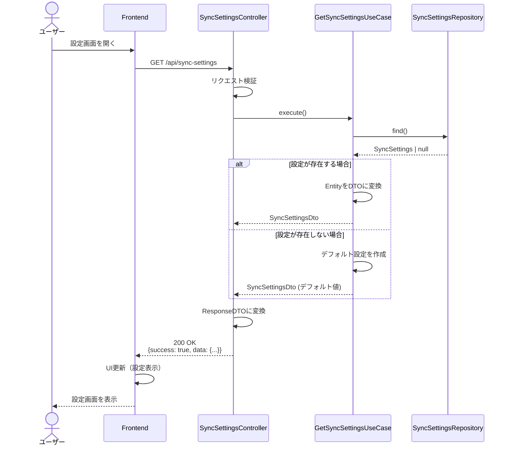
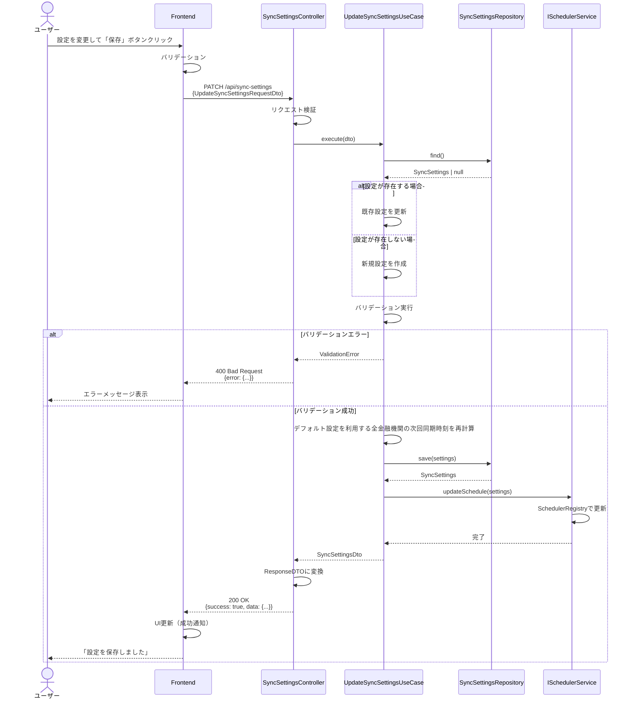
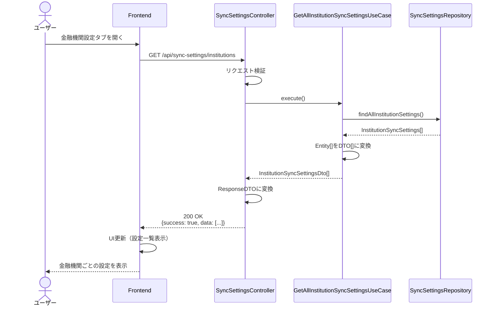
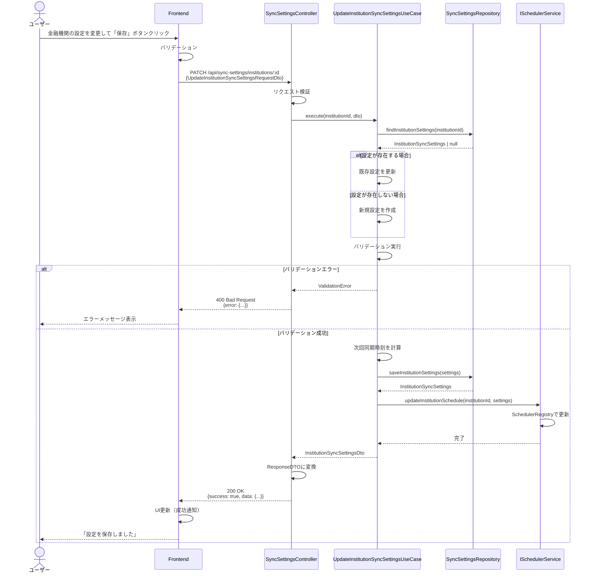
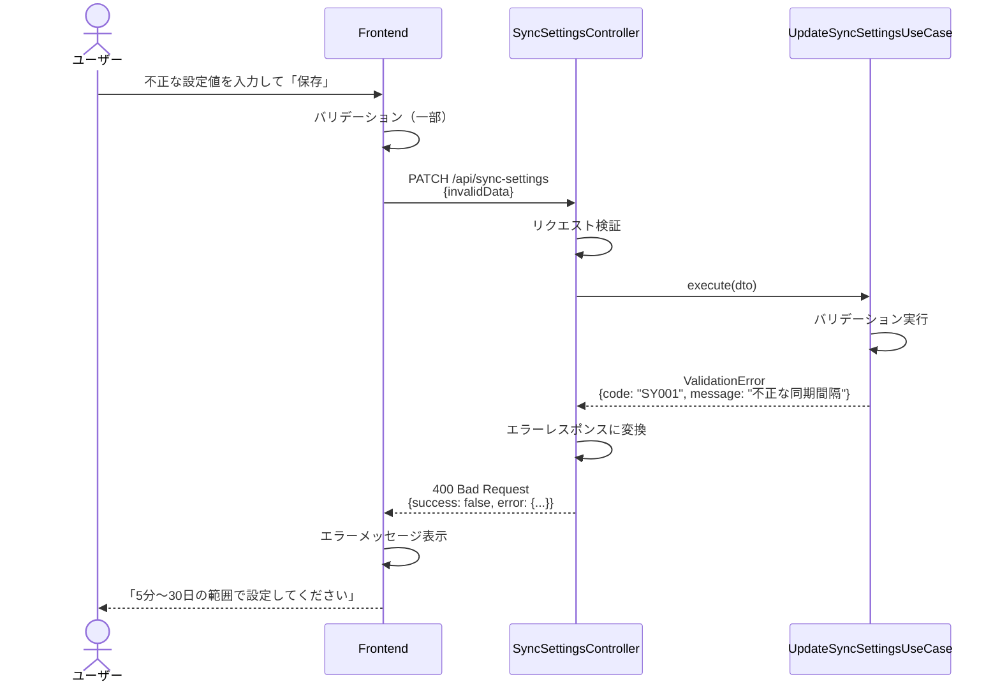
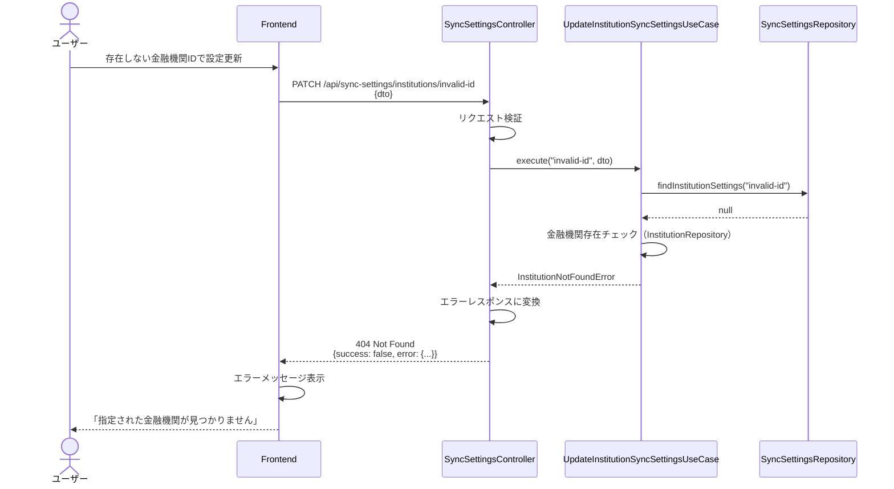
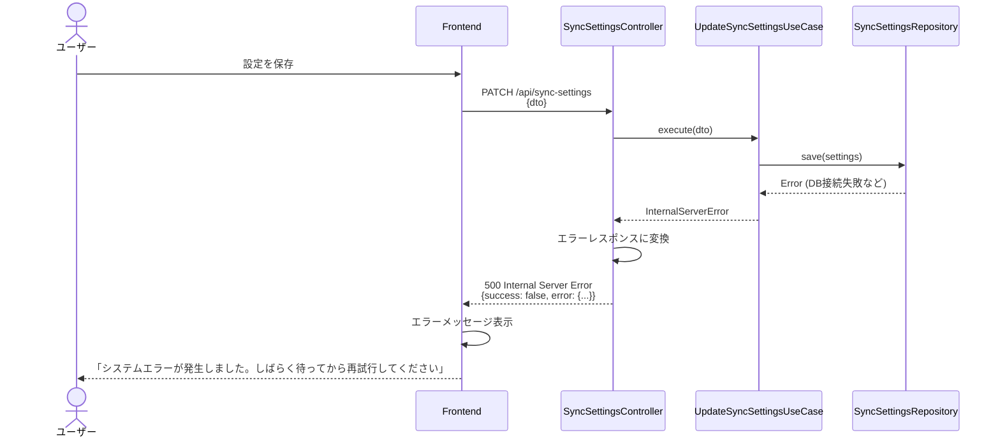

# シーケンス図

このドキュメントでは、データ同期間隔設定機能の処理フローをシーケンス図で記載しています。

## 目次

1. [全体設定取得のフロー](#全体設定取得のフロー)
2. [全体設定更新のフロー](#全体設定更新のフロー)
3. [金融機関設定取得のフロー](#金融機関設定取得のフロー)
4. [金融機関設定更新のフロー](#金融機関設定更新のフロー)
5. [エラーハンドリングフロー](#エラーハンドリングフロー)

---

## 全体設定取得のフロー

### 概要

**ユースケース**: ユーザーが設定画面を開き、現在の全体設定を表示

**アクター**: ユーザー

**前提条件**:

- ユーザーが認証済み

**成功時の結果**:

- 現在の同期設定が表示される
- 設定が存在しない場合はデフォルト値が返却される

### 正常系フロー

### ステップ詳細

1. **ユーザーアクション**
   - ユーザーが設定画面を開く

2. **API リクエスト**
   - エンドポイント: `GET /api/sync-settings`
   - 認証: JWT トークン必須

3. **設定取得**
   - リポジトリから設定を取得
   - 設定が存在しない場合はデフォルト値（標準: 6時間ごと）を返却

4. **レスポンス**
   - ResponseDTO: `SyncSettingsResponseDto`
   - HTTPステータス: 200 OK

---

## 全体設定更新のフロー

### 概要

**ユースケース**: ユーザーが同期設定を変更し、保存

**アクター**: ユーザー

**前提条件**:

- ユーザーが認証済み
- 設定画面が表示されている

**成功時の結果**:

- 設定が更新される
- スケジュールが動的に更新される
- 次回同期時刻が再計算される

### 正常系フロー

### ステップ詳細

1. **ユーザーアクション**
   - ユーザーが同期間隔や詳細オプションを変更
   - 「保存」ボタンをクリック

2. **Frontend バリデーション**
   - 同期間隔の範囲チェック（5分〜30日）
   - 夜間モード時刻の形式チェック（HH:mm）
   - 夜間モード開始時刻 < 終了時刻のチェック

3. **API リクエスト**
   - エンドポイント: `PATCH /api/sync-settings`（部分更新をサポート）
   - RequestDTO: `UpdateSyncSettingsRequestDto`（すべてのフィールドが任意）

4. **設定更新**
   - 既存設定を更新、または新規作成
   - バリデーション実行
   - デフォルト設定を利用している全金融機関の次回同期時刻を再計算

5. **スケジュール更新**
   - ISchedulerServiceを通じてスケジュールを動的に更新
   - SchedulerRegistryを使用してCronJobを再登録

6. **レスポンス**
   - ResponseDTO: `SyncSettingsResponseDto`
   - HTTPステータス: 200 OK

---

## 金融機関設定取得のフロー（全件取得）

### 概要

**ユースケース**: ユーザーが金融機関ごとの設定一覧を表示

**アクター**: ユーザー

**前提条件**:

- ユーザーが認証済み
- 金融機関が連携済み

**成功時の結果**:

- 全金融機関の同期設定が表示される
- 各金融機関の最終同期時刻、次回同期時刻が表示される

### 正常系フロー

### ステップ詳細

1. **ユーザーアクション**
   - ユーザーが設定画面の「金融機関ごとの設定」タブを開く

2. **API リクエスト**
   - エンドポイント: `GET /api/sync-settings/institutions`
   - 認証: JWT トークン必須

3. **設定取得**
   - 全金融機関の設定を取得
   - 設定が存在しない金融機関はデフォルト設定を返却

4. **レスポンス**
   - ResponseDTO: `InstitutionSyncSettingsResponseDto[]`
   - HTTPステータス: 200 OK

---

## 金融機関設定更新のフロー

### 概要

**ユースケース**: ユーザーが特定金融機関の同期間隔を変更し、保存

**アクター**: ユーザー

**前提条件**:

- ユーザーが認証済み
- 金融機関が連携済み
- 設定画面が表示されている

**成功時の結果**:

- 金融機関の設定が更新される
- 次回同期時刻が再計算される
- スケジュールが動的に更新される

### 正常系フロー

### ステップ詳細

1. **ユーザーアクション**
   - ユーザーが特定金融機関の同期間隔を変更
   - 「保存」ボタンをクリック

2. **Frontend バリデーション**
   - 同期間隔の範囲チェック（5分〜30日）
   - 必須項目のチェック

3. **API リクエスト**
   - エンドポイント: `PATCH /api/sync-settings/institutions/:id`（部分更新をサポート）
   - RequestDTO: `UpdateInstitutionSyncSettingsRequestDto`

4. **設定更新**
   - 既存設定を更新、または新規作成
   - 次回同期時刻を計算

5. **スケジュール更新**
   - 特定金融機関のスケジュールを動的に更新

6. **レスポンス**
   - ResponseDTO: `InstitutionSyncSettingsResponseDto`
   - HTTPステータス: 200 OK

---

## エラーハンドリングフロー

### バリデーションエラー

### リソース未検出エラー

### サーバーエラー

---

## チェックリスト

設計書作成時の確認事項：

### 必須項目

- [x] 主要なユースケースのシーケンス図が記載されている
- [x] 正常系と異常系のフローが記載されている
- [x] エラーハンドリングフローが記載されている
- [x] 各ステップの説明が記載されている

### 推奨項目

- [x] 前提条件と成功時の結果が明確に記載されている
- [x] バリデーションのタイミングが明確になっている
- [x] スケジュール更新のタイミングが明確になっている
