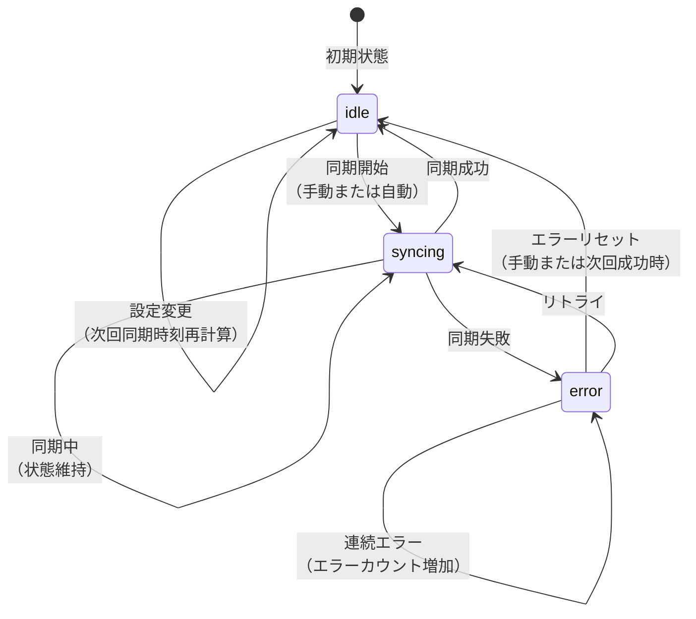
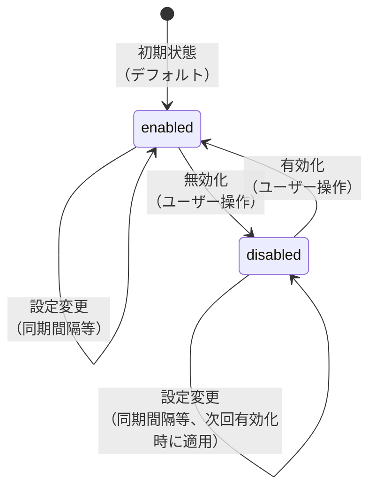
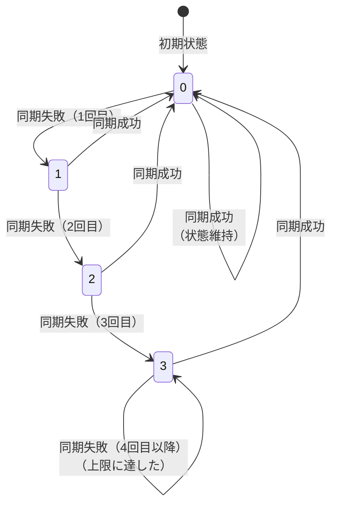

# 状態遷移図

このドキュメントでは、データ同期間隔設定機能の状態遷移を記載しています。

## 目次

1. [同期ステータスの状態遷移](#同期ステータスの状態遷移)
2. [設定の状態遷移](#設定の状態遷移)

---

## 同期ステータスの状態遷移

### 概要

金融機関ごとの同期ステータス（`InstitutionSyncSettings.syncStatus`）の状態遷移を定義します。

### 状態一覧

| 状態      | 説明                               |
| --------- | ---------------------------------- |
| `idle`    | 待機中（次回同期時刻を待っている） |
| `syncing` | 同期中（現在同期処理を実行中）     |
| `error`   | エラー（同期に失敗した）           |

### 状態遷移図

### 状態遷移の詳細

#### idle → syncing

**トリガー**:

- 手動同期: ユーザーが「今すぐ同期」ボタンをクリック
- 自動同期: 次回同期時刻に達した

**アクション**:

- `syncStatus`を`syncing`に更新
- 同期処理を開始

#### syncing → idle

**トリガー**:

- 同期が正常に完了した

**アクション**:

- `syncStatus`を`idle`に更新
- `lastSyncedAt`を現在時刻に更新
- `nextSyncAt`を再計算
- `errorCount`をリセット（0に設定）

#### syncing → error

**トリガー**:

- 同期処理中にエラーが発生した

**アクション**:

- `syncStatus`を`error`に更新
- `errorCount`を増加
- `lastError`にエラーメッセージを設定

#### error → idle

**トリガー**:

- 次回の同期が成功した
- ユーザーが手動でエラーをリセット

**アクション**:

- `syncStatus`を`idle`に更新
- `errorCount`をリセット
- `lastError`をクリア

#### error → syncing

**トリガー**:

- 自動リトライが有効で、リトライ条件を満たした

**アクション**:

- `syncStatus`を`syncing`に更新
- リトライ処理を開始

#### idle → idle

**トリガー**:

- 同期設定が変更された（同期間隔の変更等）

**アクション**:

- `nextSyncAt`を再計算
- 状態は`idle`のまま

---

## 設定の状態遷移

### 概要

同期設定の有効/無効（`InstitutionSyncSettings.enabled`）の状態遷移を定義します。

### 状態一覧

| 状態       | 説明                             |
| ---------- | -------------------------------- |
| `enabled`  | 有効（自動同期が有効）           |
| `disabled` | 無効（自動同期が無効、手動のみ） |

### 状態遷移図

### 状態遷移の詳細

#### enabled → disabled

**トリガー**:

- ユーザーが設定画面で「無効」に設定

**アクション**:

- `enabled`を`false`に更新
- 自動同期を停止
- 手動同期は引き続き可能

#### disabled → enabled

**トリガー**:

- ユーザーが設定画面で「有効」に設定

**アクション**:

- `enabled`を`true`に更新
- 自動同期を再開
- `nextSyncAt`を再計算

---

## エラーカウントの状態遷移

### 概要

エラー回数（`InstitutionSyncSettings.errorCount`）の状態遷移を定義します。

### 状態遷移図

### 状態遷移の詳細

#### エラーカウント増加

**トリガー**:

- 同期処理が失敗した

**アクション**:

- `errorCount`を1増加
- `maxRetryCount`に達した場合、自動リトライを停止
- ユーザーに通知（将来実装）

#### エラーカウントリセット

**トリガー**:

- 同期処理が成功した

**アクション**:

- `errorCount`を0にリセット
- 自動リトライを再開可能にする

---

## チェックリスト

設計書作成時の確認事項：

### 必須項目

- [x] 状態一覧が記載されている
- [x] 状態遷移図が記載されている
- [x] 各状態遷移のトリガーとアクションが記載されている

### 推奨項目

- [x] 状態遷移の詳細説明が記載されている
- [x] エッジケース（連続エラー等）が考慮されている
