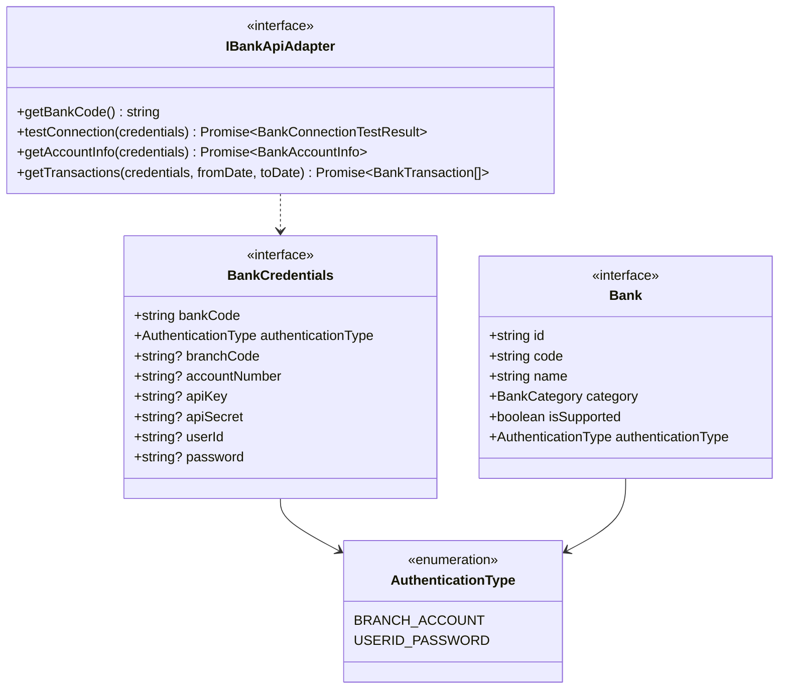
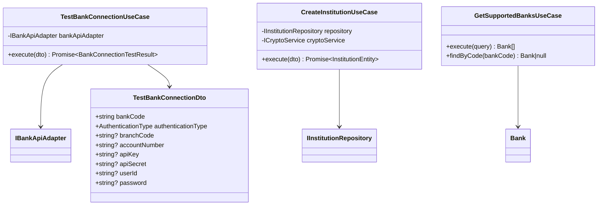
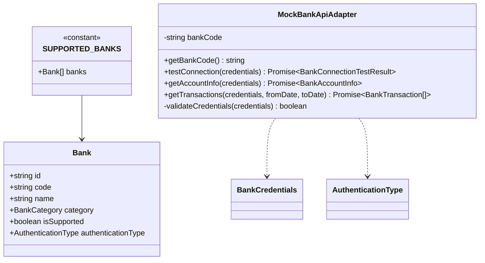
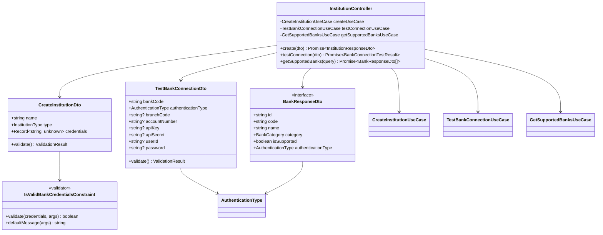
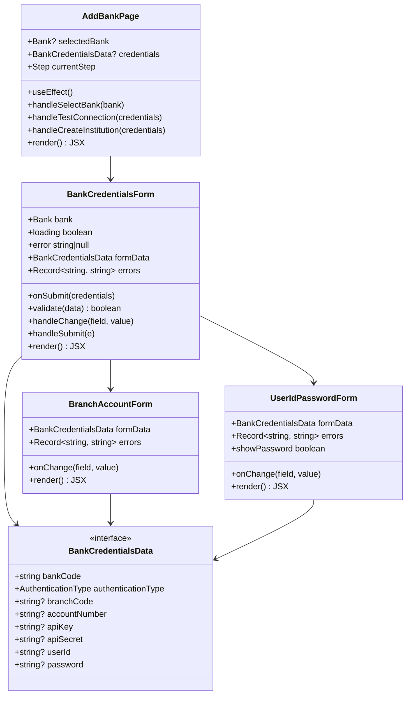
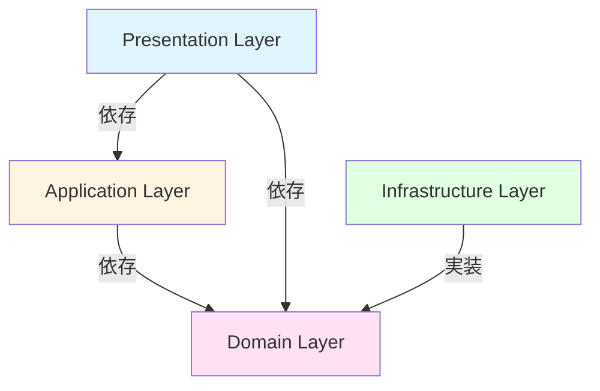
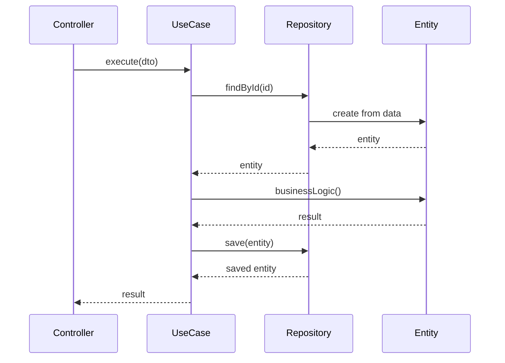
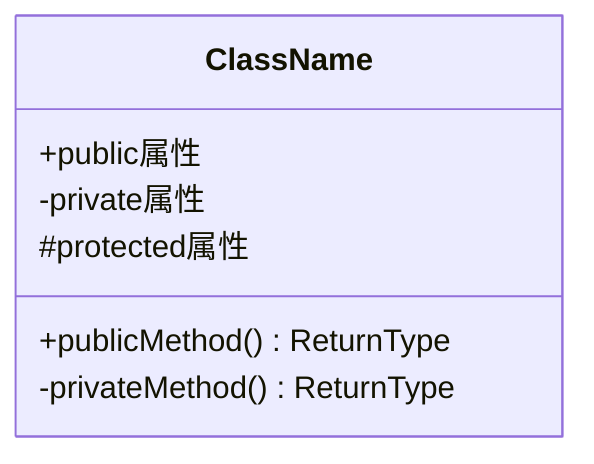
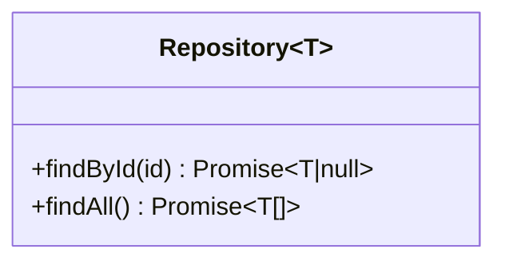

# クラス図

このドキュメントでは、銀行認証方式の拡張機能のクラス構造を記載しています。

## 目次

1. [Domain層クラス図](#domain層クラス図)
2. [Application層クラス図](#application層クラス図)
3. [Infrastructure層クラス図](#infrastructure層クラス図)
4. [Presentation層クラス図](#presentation層クラス図)
5. [Frontend コンポーネント図](#frontendコンポーネント図)

---

## Domain層クラス図

### Bank Authentication Module (FR-410)

**クラス説明**:

#### AuthenticationType

- **責務**: 銀行認証方式の種類を定義する列挙型
- **値**:
  - `BRANCH_ACCOUNT`: 支店コード＋口座番号認証
  - `USERID_PASSWORD`: ユーザID＋パスワード認証
- **拡張性**: 将来的に他の認証方式（例: OAuth、APIキーのみ）も追加可能

#### BankCredentials

- **責務**: 銀行認証情報を表現するインターフェース
- **フィールド**:
  - `bankCode`: 銀行コード（4桁数字、必須）
  - `authenticationType`: 認証タイプ（必須）
  - `branchCode`, `accountNumber`: 支店コード＋口座番号認証の場合に必須
  - `userId`, `password`: ユーザID＋パスワード認証の場合に必須
  - `apiKey`, `apiSecret`: オプション（銀行によって異なる）
- **型安全性**: 認証タイプに応じて必須フィールドが異なるため、バリデーションで制御

#### Bank

- **責務**: 銀行情報を表現するインターフェース（拡張）
- **新規フィールド**:
  - `authenticationType`: この銀行が使用する認証タイプ
- **実装箇所**: `apps/backend/src/modules/institution/infrastructure/data/banks.data.ts`

#### IBankApiAdapter

- **責務**: 銀行APIアダプターのインターフェース（変更なし）
- **メソッド**: 既存のメソッドは変更なし。認証方式の拡張により、`BankCredentials`の構造が拡張される

---

## Application層クラス図

### Use Cases (変更なし)

既存のUseCaseは変更なし。認証方式の拡張により、DTOの構造が拡張されます。

**クラス説明**:

#### TestBankConnectionUseCase

- **責務**: 銀行接続テストの実行（変更なし）
- **依存**: `IBankApiAdapter`
- **入力**: `TestBankConnectionDto`（拡張: `authenticationType`、`userId`、`password`フィールド追加）
- **出力**: `BankConnectionTestResult`（変更なし）

#### CreateInstitutionUseCase

- **責務**: 金融機関登録の実行（変更なし）
- **依存**: `IInstitutionRepository`、`ICryptoService`
- **入力**: `CreateInstitutionDto`（拡張: `credentials`の構造が拡張）
- **出力**: `InstitutionEntity`（変更なし）

#### GetSupportedBanksUseCase

- **責務**: 対応銀行一覧取得（拡張: `authenticationType`情報を含む）
- **出力**: `Bank[]`（拡張: `authenticationType`フィールド追加）

#### TestBankConnectionDto

- **責務**: 接続テストリクエストデータ（拡張）
- **新規フィールド**:
  - `authenticationType`: 認証タイプ（必須）
  - `userId`, `password`: ユーザID＋パスワード認証の場合に必須
- **既存フィールド**: `bankCode`、`branchCode`、`accountNumber`、`apiKey`、`apiSecret`（支店コード＋口座番号認証の場合に必須）

---

## Infrastructure層クラス図

### Bank Data (拡張)

**クラス説明**:

#### SUPPORTED_BANKS

- **責務**: 対応銀行マスターデータ（拡張）
- **実装箇所**: `apps/backend/src/modules/institution/infrastructure/data/banks.data.ts`
- **拡張内容**: 各銀行に`authenticationType`フィールドを追加
  - 三菱UFJ銀行（0005）: `USERID_PASSWORD`
  - みずほ銀行（0001）: `USERID_PASSWORD`
  - その他の銀行: `BRANCH_ACCOUNT`（既存）

#### MockBankApiAdapter

- **責務**: モック銀行APIアダプター（拡張）
- **拡張内容**: `validateCredentials`メソッドを拡張し、認証タイプに応じたバリデーションを実装
  - `BRANCH_ACCOUNT`: `branchCode`、`accountNumber`をチェック
  - `USERID_PASSWORD`: `userId`、`password`をチェック

---

## Presentation層クラス図

### Controllers & DTOs (拡張)

**クラス説明**:

#### InstitutionController

- **責務**: 金融機関管理APIのコントローラー（変更なし）
- **エンドポイント**:
  - `POST /api/institutions`: 金融機関登録（`credentials`の構造が拡張）
  - `POST /api/institutions/test-connection`: 接続テスト（`credentials`の構造が拡張）
  - `GET /api/institutions/supported-banks`: 対応銀行一覧取得（`authenticationType`情報を含む）

#### CreateInstitutionDto

- **責務**: 金融機関登録リクエストDTO（拡張）
- **バリデーション**: `IsValidBankCredentialsConstraint`を拡張し、認証タイプに応じたバリデーションを実装
- **拡張内容**: `credentials`フィールドの構造が拡張（`authenticationType`、`userId`、`password`フィールド追加）

#### TestBankConnectionDto

- **責務**: 接続テストリクエストDTO（拡張）
- **新規フィールド**:
  - `authenticationType`: 認証タイプ（必須）
  - `userId`, `password`: ユーザID＋パスワード認証の場合に必須
- **既存フィールド**: `bankCode`、`branchCode`、`accountNumber`、`apiKey`、`apiSecret`（支店コード＋口座番号認証の場合に必須）

#### IsValidBankCredentialsConstraint

- **責務**: 銀行認証情報のバリデーション（拡張）
- **拡張内容**: 認証タイプに応じたバリデーションロジックを実装
  - `BRANCH_ACCOUNT`: `bankCode`、`branchCode`、`accountNumber`をチェック
  - `USERID_PASSWORD`: `bankCode`、`userId`、`password`をチェック
- **実装箇所**: `apps/backend/src/modules/institution/presentation/dto/create-institution.dto.ts`

#### BankResponseDto

- **責務**: 銀行情報レスポンスDTO（拡張）
- **新規フィールド**: `authenticationType`（認証タイプ情報）

---

## Frontend コンポーネント図

### React Components

**コンポーネント説明**:

#### AddBankPage

- **責務**: 銀行追加ページ（変更なし）
- **State**: `selectedBank`、`credentials`、`currentStep`
- **API連携**: `POST /api/institutions/test-connection`、`POST /api/institutions`
- **拡張内容**: 認証方式に応じたフォームの切り替えロジックを追加

#### BankCredentialsForm

- **責務**: 銀行認証情報入力フォーム（拡張）
- **Props**:
  - `bank`: 選択された銀行（`authenticationType`情報を含む）
  - `onSubmit`: フォーム送信時のコールバック
  - `loading`: ローディング状態
  - `error`: エラーメッセージ
- **拡張内容**: 認証タイプに応じて`BranchAccountForm`または`UserIdPasswordForm`を表示
- **バリデーション**: 認証タイプに応じたバリデーションを実装
- **実装箇所**: `apps/frontend/src/components/forms/BankCredentialsForm.tsx`

#### BranchAccountForm

- **責務**: 支店コード＋口座番号入力フォーム（新規）
- **フィールド**: `branchCode`、`accountNumber`、`apiKey`、`apiSecret`
- **バリデーション**: 支店コード（3桁数字）、口座番号（7桁数字）

#### UserIdPasswordForm

- **責務**: ユーザID＋パスワード入力フォーム（新規）
- **フィールド**: `userId`、`password`
- **バリデーション**: ユーザID（1-100文字）、パスワード（8-100文字）
- **セキュリティ**: パスワード入力フィールドは`type="password"`を使用

#### BankCredentialsData

- **責務**: 銀行認証情報データ型（拡張）
- **新規フィールド**: `authenticationType`、`userId`、`password`
- **既存フィールド**: `bankCode`、`branchCode`、`accountNumber`、`apiKey`、`apiSecret`

---

## クラス間の関係性

### 依存関係の概要

### データフロー

---

## 実装上の注意点

### 型安全性

- すべてのクラスとメソッドに適切な型定義を行う
- `any`型の使用を避ける
- Genericsを活用して型の再利用性を高める

### 依存性注入

- コンストラクタインジェクションを使用
- インターフェースに依存し、実装に依存しない
- NestJSのDIコンテナを活用

### イミュータビリティ

- Value Objectは不変とする
- Entityの更新は新しいインスタンスを返す
- Stateの直接変更を避ける

### エラーハンドリング

- カスタム例外クラスを定義
- 適切なエラーメッセージを提供
- エラーのロギング

---

## チェックリスト

クラス図作成時の確認事項：

### Domain層

- [ ] すべてのEntityが定義されている
- [ ] Value Objectが適切に定義されている
- [ ] Repositoryインターフェースが定義されている
- [ ] ビジネスロジックがEntityに配置されている

### Application層

- [ ] すべてのUseCaseが定義されている
- [ ] DTOが適切に定義されている
- [ ] サービスクラスが必要に応じて定義されている

### Infrastructure層

- [ ] Repositoryの実装クラスが定義されている
- [ ] 外部APIクライアントが定義されている（必要な場合）
- [ ] 永続化方法が明確

### Presentation層

- [ ] すべてのControllerが定義されている
- [ ] RequestDTO、ResponseDTOが定義されている
- [ ] エンドポイントが明確

### Frontend（画面がある場合）

- [ ] ページコンポーネントが定義されている
- [ ] 主要な子コンポーネントが定義されている
- [ ] Props、Stateが明確

---

## Mermaid記法のヒント

### クラス定義

### 関係性

- `-->`: 依存（Dependency）
- `--|>`: 継承（Inheritance）
- `..|>`: 実装（Implementation）
- `--*`: コンポジション（Composition）
- `--o`: 集約（Aggregation）

### ジェネリクス

