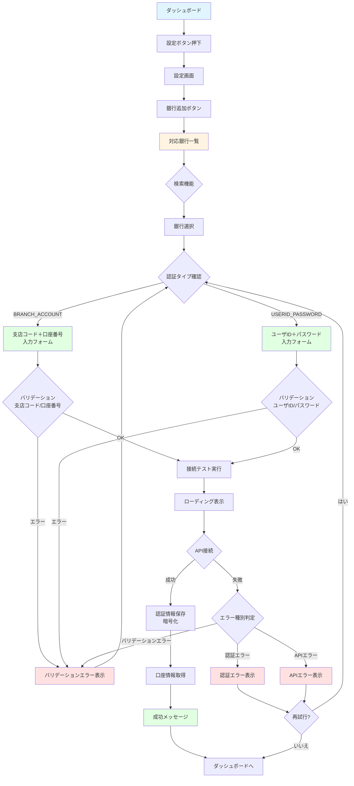
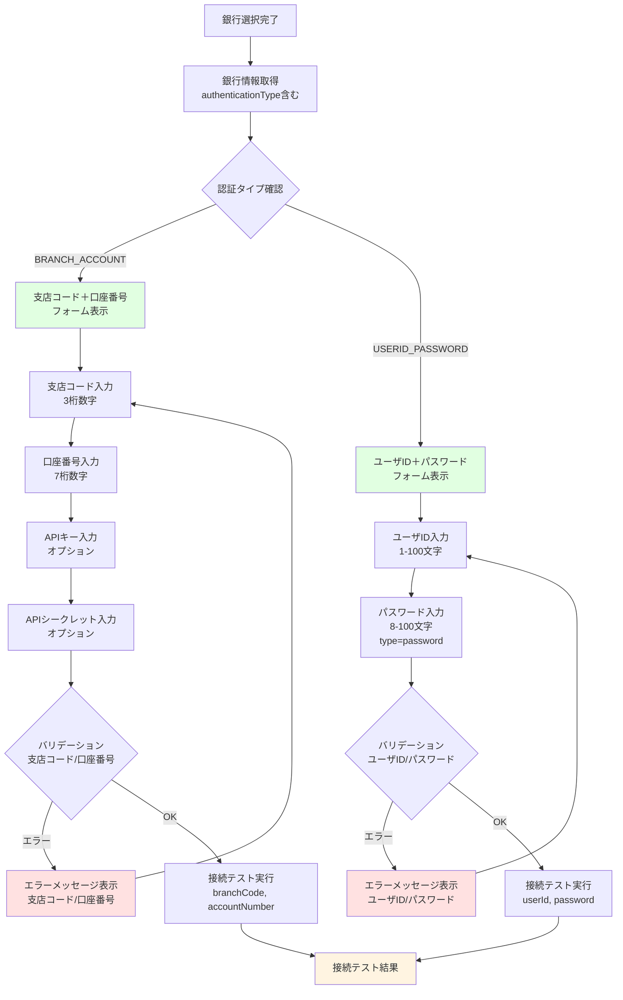
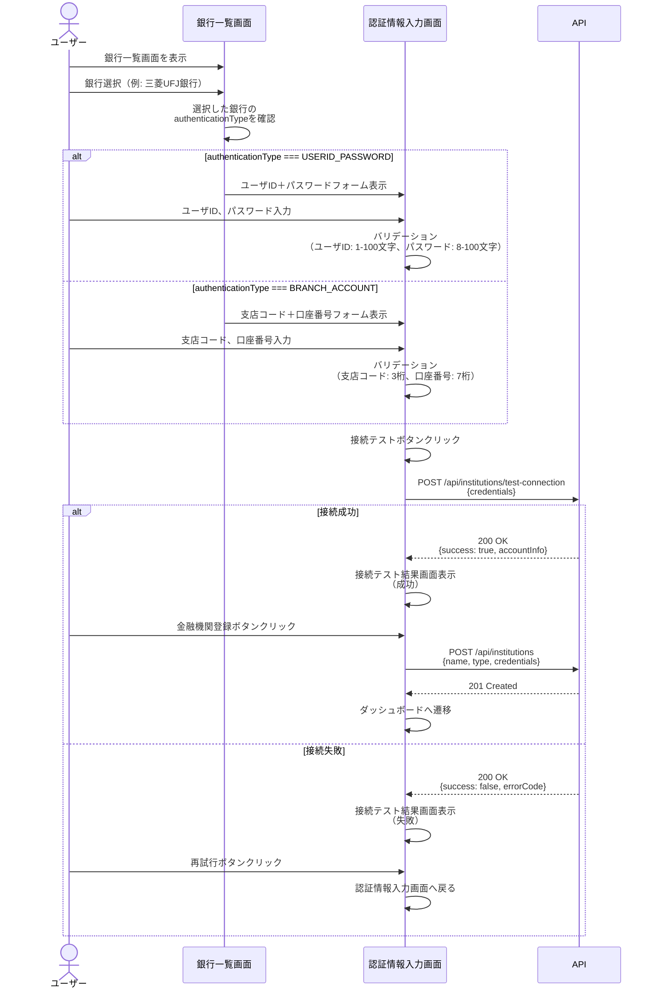
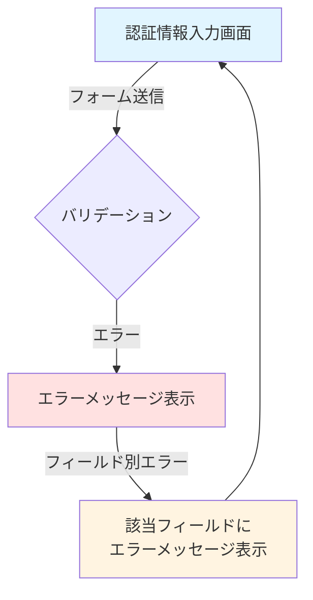
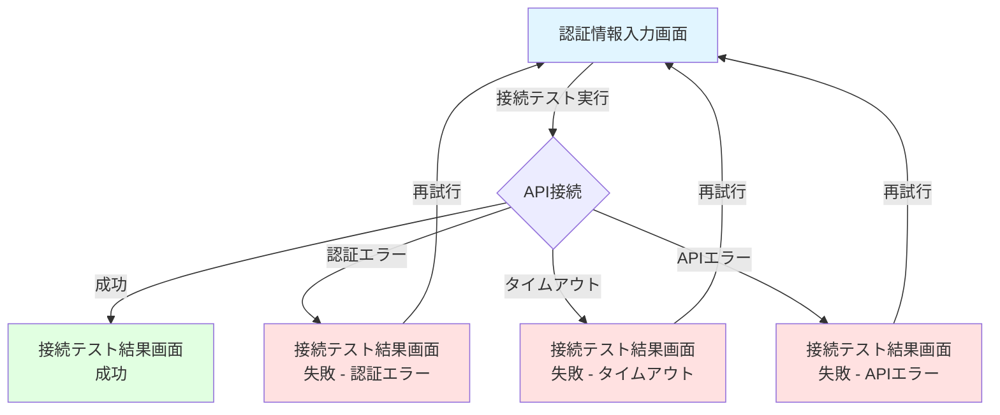
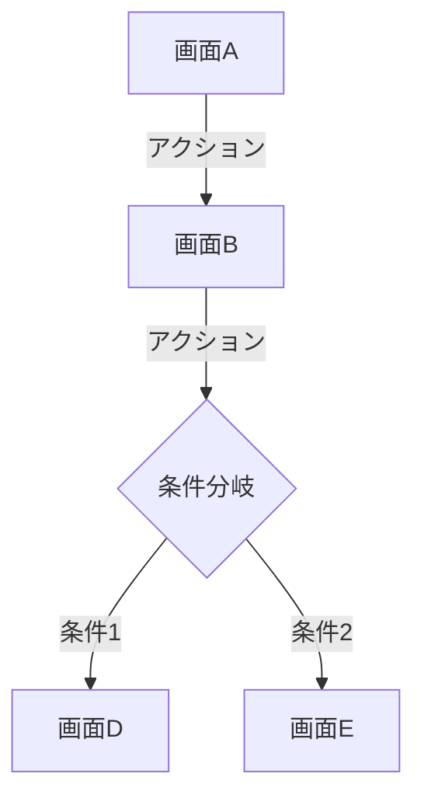
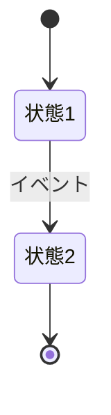
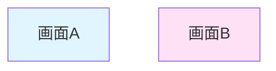

# 画面遷移図

このドキュメントでは、銀行認証方式の拡張機能の画面遷移を記載しています。

## 目次

1. [画面遷移全体図](#画面遷移全体図)
2. [銀行追加フロー（認証方式に応じたフォーム切り替え）](#銀行追加フロー認証方式に応じたフォーム切り替え)
3. [各画面の詳細](#各画面の詳細)
4. [画面仕様](#画面仕様)

---

## 画面遷移全体図

### メイン遷移フロー



### 画面の種類

- **対応銀行一覧画面**: 対応銀行の一覧表示、検索、フィルタリング
- **認証情報入力画面**: 認証方式に応じた入力フォーム（支店コード＋口座番号 / ユーザID＋パスワード）
- **接続テスト結果画面**: 接続テストの結果表示（成功/失敗）
- **エラー表示**: バリデーションエラー、認証エラー、APIエラーの表示

---

## 銀行追加フロー（認証方式に応じたフォーム切り替え）

### 認証方式別のフォーム切り替えフロー



---

## 各画面の詳細

### 1. 対応銀行一覧画面

#### 画面ID

`bank-list`

#### URL

`/banks/add`

#### 概要

対応銀行の一覧を表示し、銀行を選択できる画面。各銀行の認証タイプ情報を含む。

#### 表示内容

- 銀行一覧（カード形式またはリスト形式）
  - 銀行名
  - 銀行コード
  - 銀行カテゴリ（メガバンク、地方銀行、ネット銀行）
  - 認証タイプ（表示用、内部で使用）
- 検索フォーム
  - 銀行名検索
  - 銀行コード検索
- カテゴリフィルタ
  - メガバンク
  - 地方銀行
  - ネット銀行

#### 遷移先

- `bank-credentials-form`: 銀行選択時（認証タイプ情報を渡す）

#### API連携

- `GET /api/institutions/supported-banks`: 対応銀行一覧取得（`authenticationType`情報を含む）

---

### 2. 認証情報入力画面

#### 画面ID

`bank-credentials-form`

#### URL

`/banks/add`（ステップ2）

#### 概要

選択した銀行の認証方式に応じて、適切な入力フォームを表示する画面。

#### 表示内容

##### 支店コード＋口座番号認証の場合

- 銀行名表示（選択した銀行）
- 銀行コード（自動入力、編集不可）
- 支店コード入力欄
  - ラベル: "支店コード"
  - プレースホルダー: "例: 001"
  - バリデーション: 3桁数字
  - エラーメッセージ: "支店コードは3桁の数字で入力してください"
- 口座番号入力欄
  - ラベル: "口座番号"
  - プレースホルダー: "例: 1234567"
  - バリデーション: 7桁数字
  - エラーメッセージ: "口座番号は7桁の数字で入力してください"
- APIキー入力欄（オプション）
  - ラベル: "APIキー（オプション）"
  - プレースホルダー: "銀行から発行されたAPIキーを入力"
- APIシークレット入力欄（オプション）
  - ラベル: "APIシークレット（オプション）"
  - プレースホルダー: "銀行から発行されたAPIシークレットを入力"
  - タイプ: `password`（表示/非表示切り替えボタン付き）
- 接続テストボタン

##### ユーザID＋パスワード認証の場合

- 銀行名表示（選択した銀行）
- 銀行コード（自動入力、編集不可）
- ユーザID入力欄
  - ラベル: "ユーザID"
  - プレースホルダー: "例: user123"
  - バリデーション: 1-100文字
  - エラーメッセージ: "ユーザIDは1-100文字で入力してください"
- パスワード入力欄
  - ラベル: "パスワード"
  - プレースホルダー: "パスワードを入力"
  - バリデーション: 8-100文字
  - タイプ: `password`（表示/非表示切り替えボタン付き）
  - エラーメッセージ: "パスワードは8-100文字で入力してください"
- 接続テストボタン

#### 遷移先

- `connection-test-result`: 接続テスト実行時
- `bank-list`: 戻るボタンクリック時

#### API連携

- `POST /api/institutions/test-connection`: 接続テスト実行

---

### 3. 接続テスト結果画面

#### 画面ID

`connection-test-result`

#### URL

`/banks/add`（ステップ3）

#### 概要

接続テストの結果を表示する画面。

#### 表示内容

##### 成功時

- 成功メッセージ
  - "接続に成功しました"
- 口座情報表示
  - 銀行名
  - 支店名
  - 口座番号
  - 口座名義
  - 口座種別
  - 残高
  - 利用可能残高
- 金融機関登録ボタン
- 戻るボタン

##### 失敗時

- エラーメッセージ
  - エラーコード
  - エラーメッセージ
- 再試行ボタン
- 戻るボタン

#### 遷移先

- `bank-credentials-form`: 再試行ボタンクリック時
- `dashboard`: 金融機関登録完了時
- `bank-list`: 戻るボタンクリック時

#### API連携

- `POST /api/institutions`: 金融機関登録（接続テスト成功時）

---

## 画面仕様

### 認証情報入力画面（支店コード＋口座番号認証）

#### ワイヤーフレーム（テキスト版）

```
┌─────────────────────────────────────────────────────────┐
│  [< 戻る]                                               │
├─────────────────────────────────────────────────────────┤
│  銀行追加 - 認証情報入力                                 │
│                                                         │
│  ┌─────────────────────────────────────────────────┐   │
│  │ 接続先銀行                                       │   │
│  │ 三井住友銀行                                     │   │
│  └─────────────────────────────────────────────────┘   │
│                                                         │
│  銀行コード *                                           │
│  [0009] (自動入力、編集不可)                            │
│                                                         │
│  支店コード *                                           │
│  [___] 例: 001                                         │
│  ※ 3桁の数字で入力してください                         │
│                                                         │
│  口座番号 *                                             │
│  [_______] 例: 1234567                                 │
│  ※ 7桁の数字で入力してください                         │
│                                                         │
│  APIキー（オプション）                                  │
│  [____________________]                                 │
│  ※ 銀行によっては必要な場合があります                  │
│                                                         │
│  APIシークレット（オプション）                          │
│  [____________________] [表示/非表示]                   │
│  ※ 銀行によっては必要な場合があります                  │
│                                                         │
│  ┌─────────────────────────────────────────────────┐   │
│  │ ⚠️ セキュリティに関する注意                      │   │
│  │ 入力された認証情報は暗号化されて安全に保存されます│   │
│  └─────────────────────────────────────────────────┘   │
│                                                         │
│  [接続テスト]                                           │
└─────────────────────────────────────────────────────────┘
```

### 認証情報入力画面（ユーザID＋パスワード認証）

#### ワイヤーフレーム（テキスト版）

```
┌─────────────────────────────────────────────────────────┐
│  [< 戻る]                                               │
├─────────────────────────────────────────────────────────┤
│  銀行追加 - 認証情報入力                                 │
│                                                         │
│  ┌─────────────────────────────────────────────────┐   │
│  │ 接続先銀行                                       │   │
│  │ 三菱UFJ銀行                                      │   │
│  └─────────────────────────────────────────────────┘   │
│                                                         │
│  銀行コード *                                           │
│  [0005] (自動入力、編集不可)                            │
│                                                         │
│  ユーザID *                                             │
│  [____________________] 例: user123                    │
│  ※ 1-100文字で入力してください                         │
│                                                         │
│  パスワード *                                           │
│  [____________________] [表示/非表示]                   │
│  ※ 8-100文字で入力してください                         │
│                                                         │
│  ┌─────────────────────────────────────────────────┐   │
│  │ ⚠️ セキュリティに関する注意                      │   │
│  │ 入力された認証情報は暗号化されて安全に保存されます│   │
│  └─────────────────────────────────────────────────┘   │
│                                                         │
│  [接続テスト]                                           │
└─────────────────────────────────────────────────────────┘
```

### 接続テスト結果画面（成功時）

#### ワイヤーフレーム（テキスト版）

```
┌─────────────────────────────────────────────────────────┐
│  [< 戻る]                                               │
├─────────────────────────────────────────────────────────┤
│  接続テスト結果                                         │
│                                                         │
│  ✅ 接続に成功しました                                   │
│                                                         │
│  ┌─────────────────────────────────────────────────┐   │
│  │ 口座情報                                        │   │
│  │                                                 │   │
│  │  銀行名: 三菱UFJ銀行                            │   │
│  │  支店名: 本店                                    │   │
│  │  口座番号: 1234567                              │   │
│  │  口座名義: ヤマダ　タロウ                        │   │
│  │  口座種別: 普通預金                              │   │
│  │  残高: ¥1,000,000                               │   │
│  │  利用可能残高: ¥1,000,000                       │   │
│  └─────────────────────────────────────────────────┘   │
│                                                         │
│  [金融機関を登録する]                                    │
│  [戻る]                                                 │
└─────────────────────────────────────────────────────────┘
```

### 接続テスト結果画面（失敗時）

#### ワイヤーフレーム（テキスト版）

```
┌─────────────────────────────────────────────────────────┐
│  [< 戻る]                                               │
├─────────────────────────────────────────────────────────┤
│  接続テスト結果                                         │
│                                                         │
│  ❌ 接続に失敗しました                                   │
│                                                         │
│  ┌─────────────────────────────────────────────────┐   │
│  │ エラー情報                                        │   │
│  │                                                 │   │
│  │  エラーコード: BE001                            │   │
│  │  エラーメッセージ: 認証に失敗しました           │   │
│  │                                                 │   │
│  │  考えられる原因:                                │   │
│  │  - ユーザIDまたはパスワードが正しくない         │   │
│  │  - アカウントがロックされている                 │   │
│  └─────────────────────────────────────────────────┘   │
│                                                         │
│  [再試行]                                               │
│  [戻る]                                                 │
└─────────────────────────────────────────────────────────┘
```

---

## ユーザー操作フロー

### 銀行追加フロー（認証方式に応じたフォーム切り替え）



---

## エラーハンドリング

### バリデーションエラー



### 接続テストエラー



---

## レスポンシブ対応

### デスクトップ表示（1024px以上）

- テーブル形式で表示
- サイドバーメニュー表示

### タブレット表示（768px - 1023px）

- テーブル形式で表示（スクロール可能）
- ハンバーガーメニュー

### モバイル表示（767px以下）

- カード形式で表示
- ハンバーガーメニュー
- アクションボタンをアイコン化

---

## チェックリスト

画面遷移図作成時の確認事項：

### 基本項目

- [ ] すべての画面が定義されている
- [ ] 画面間の遷移が明確に記載されている
- [ ] 各画面のURLが定義されている
- [ ] 各画面のAPIエンドポイントが明確

### 詳細項目

- [ ] エラー時の遷移が定義されている
- [ ] ワイヤーフレームが作成されている
- [ ] バリデーションルールが記載されている
- [ ] レスポンシブ対応が考慮されている

### UX

- [ ] ユーザーの操作フローが自然
- [ ] 戻る動線が明確
- [ ] エラーメッセージが適切
- [ ] 成功メッセージが適切

---

## Mermaid記法のヒント

### Graph（画面遷移図）



### State Diagram（状態遷移図）



### スタイリング


