# シーケンス図

このドキュメントでは、銀行認証方式の拡張機能の処理フローをシーケンス図で記載しています。

## 目次

1. [銀行追加フロー（認証方式に応じたフォーム切り替え）](#銀行追加フロー認証方式に応じたフォーム切り替え)
2. [接続テストフロー（認証方式に応じたバリデーション）](#接続テストフロー認証方式に応じたバリデーション)
3. [金融機関登録フロー（認証方式に応じた処理）](#金融機関登録フロー認証方式に応じた処理)
4. [対応銀行一覧取得フロー（認証タイプ情報を含む）](#対応銀行一覧取得フロー認証タイプ情報を含む)

---

## 銀行追加フロー（認証方式に応じたフォーム切り替え）

### 概要

**ユースケース**: ユーザーが銀行を追加する際、選択した銀行の認証方式に応じて適切な入力フォームを表示する

**アクター**: ユーザー

**前提条件**:

- ユーザーがログインしている
- 対応銀行一覧が取得済み

**成功時の結果**:

- 認証方式に応じた入力フォームが表示される
- ユーザーが認証情報を入力できる

### 正常系フロー

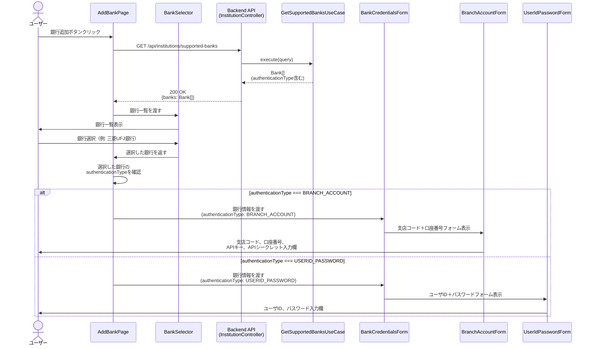

### ステップ詳細

1. **銀行一覧取得**
   - エンドポイント: `GET /api/institutions/supported-banks`
   - レスポンス: `Bank[]`（各銀行に`authenticationType`フィールドを含む）

2. **銀行選択**
   - ユーザーが銀行を選択
   - 選択した銀行の`authenticationType`を確認

3. **フォーム切り替え**
   - `BRANCH_ACCOUNT`: `BranchAccountForm`を表示（支店コード、口座番号、APIキー、APIシークレット）
   - `USERID_PASSWORD`: `UserIdPasswordForm`を表示（ユーザID、パスワード）

4. **認証情報入力**
   - 認証方式に応じたフィールドのみが表示される
   - 不要なフィールドは表示されない

---

## 接続テストフロー（認証方式に応じたバリデーション）

### 概要

**ユースケース**: ユーザーが入力した認証情報で銀行接続テストを実行する。認証方式に応じたバリデーションを実施する

**アクター**: ユーザー

**前提条件**:

- 銀行が選択されている
- 認証情報が入力されている

**成功時の結果**:

- 接続テストが成功し、口座情報が取得できる
- エラーの場合は適切なエラーメッセージが表示される

### 正常系フロー（支店コード＋口座番号認証）

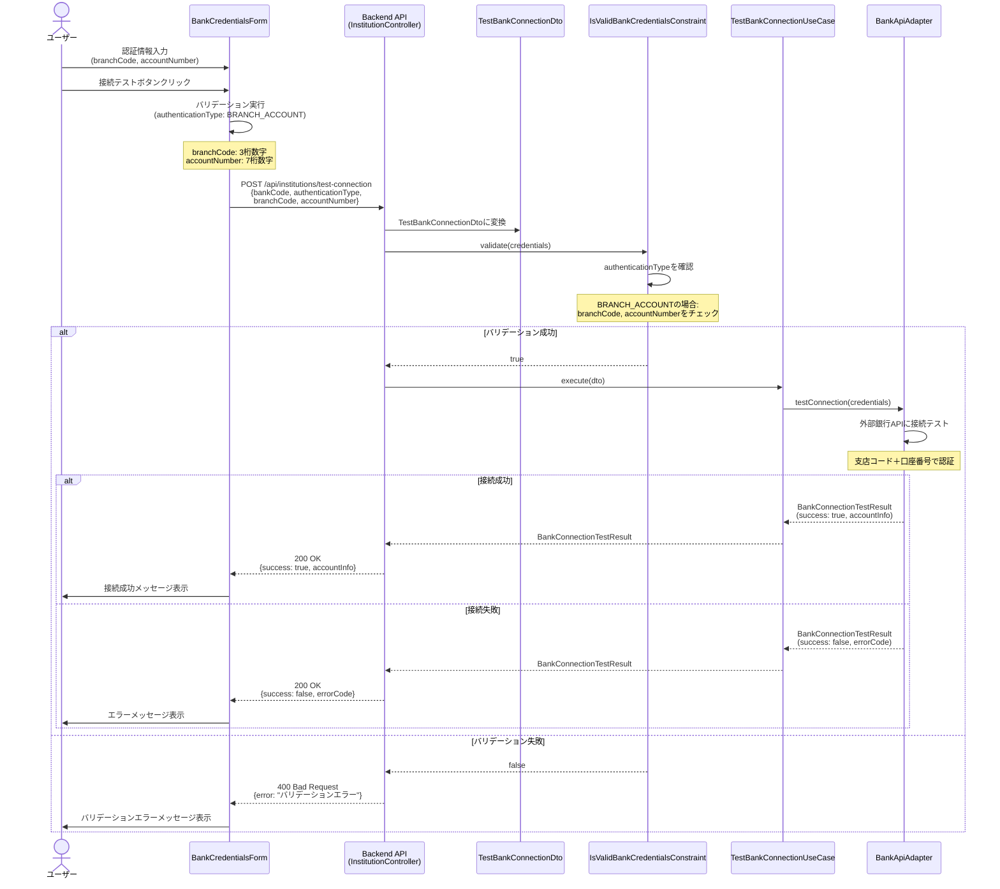

### 正常系フロー（ユーザID＋パスワード認証）

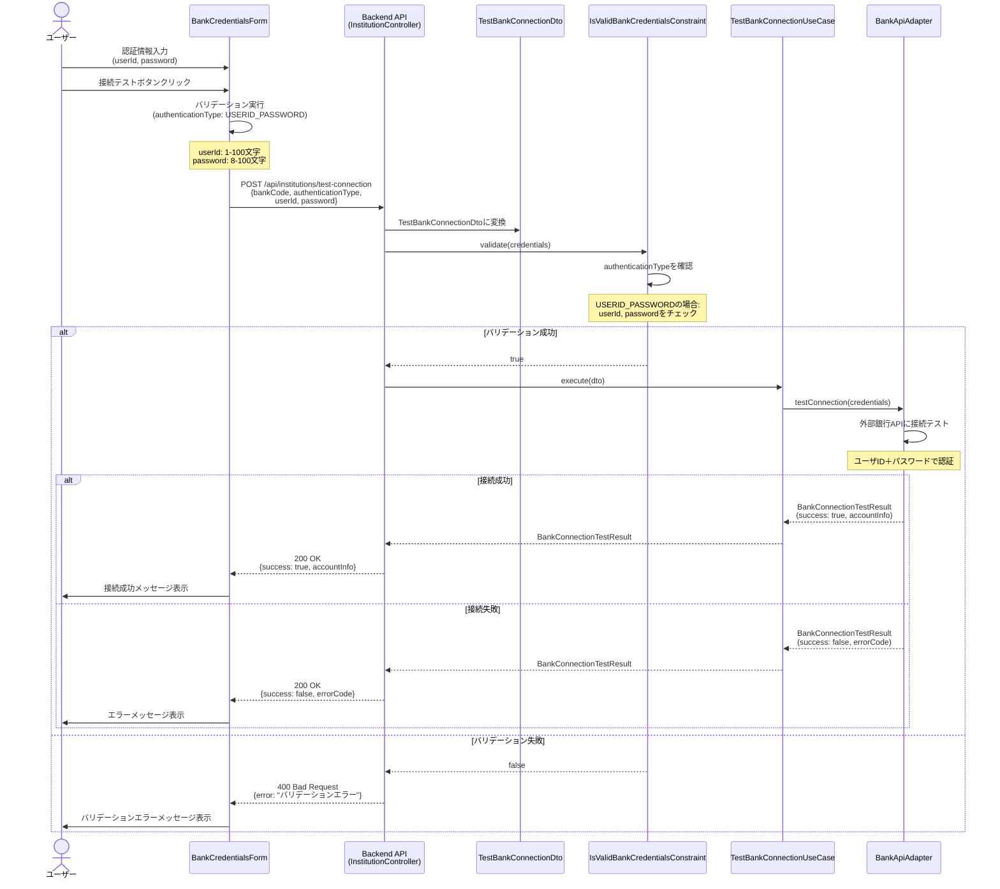

### ステップ詳細

1. **認証情報入力**
   - 認証方式に応じたフィールドに入力
   - `BRANCH_ACCOUNT`: 支店コード、口座番号、APIキー、APIシークレット
   - `USERID_PASSWORD`: ユーザID、パスワード

2. **フロントエンドバリデーション**
   - 認証方式に応じたバリデーションを実行
   - `BRANCH_ACCOUNT`: 支店コード（3桁数字）、口座番号（7桁数字）
   - `USERID_PASSWORD`: ユーザID（1-100文字）、パスワード（8-100文字）

3. **バックエンドバリデーション**
   - `IsValidBankCredentialsConstraint`で認証方式に応じたバリデーション
   - 必須フィールドの存在、型、フォーマットをチェック

4. **接続テスト実行**
   - `BankApiAdapter`で外部銀行APIに接続テスト
   - 認証方式に応じた認証情報を使用

5. **結果表示**
   - 成功: 口座情報を表示
   - 失敗: エラーメッセージを表示

## 金融機関登録フロー（認証方式に応じた処理）

### 概要

**ユースケース**: 接続テスト成功後、金融機関を登録する。認証情報は暗号化して保存する

**アクター**: ユーザー

**前提条件**:

- 接続テストが成功している
- 認証情報が入力されている

**成功時の結果**:

- 金融機関が登録される
- 認証情報が暗号化されて保存される

### 正常系フロー

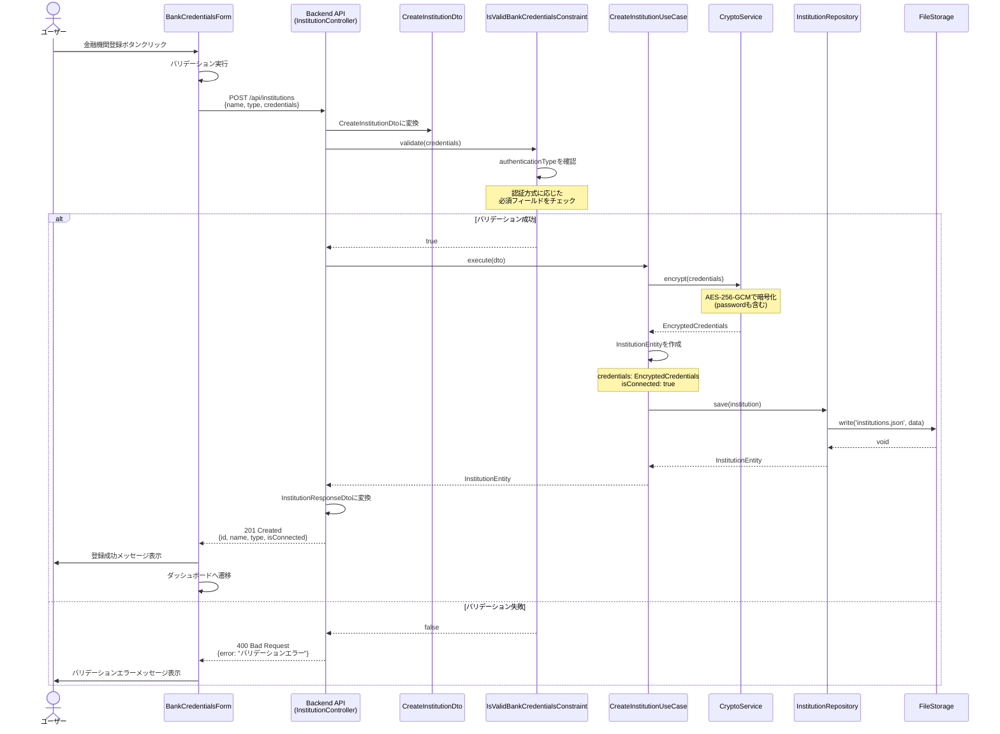

### ステップ詳細

1. **金融機関登録リクエスト**
   - エンドポイント: `POST /api/institutions`
   - RequestDTO: `CreateInstitutionDto`（`credentials`に認証方式に応じたフィールドを含む）

2. **バリデーション**
   - `IsValidBankCredentialsConstraint`で認証方式に応じたバリデーション
   - 必須フィールドの存在、型、フォーマットをチェック

3. **認証情報の暗号化**
   - `CryptoService`で認証情報を暗号化（AES-256-GCM）
   - パスワードも含めて暗号化

4. **金融機関エンティティの作成**
   - `InstitutionEntity`を作成
   - `credentials`は`EncryptedCredentials`として保存

5. **データ永続化**
   - `InstitutionRepository`で保存
   - ファイルストレージまたはデータベースに保存

6. **レスポンス**
   - `InstitutionResponseDto`を返す
   - 認証情報はレスポンスに含めない（セキュリティ）

## 対応銀行一覧取得フロー（認証タイプ情報を含む）

### 概要

**ユースケース**: 対応銀行一覧を取得し、各銀行の認証タイプ情報を含めて返す

**アクター**: ユーザー（フロントエンド）

**前提条件**: なし

**成功時の結果**:

- 対応銀行一覧が取得できる
- 各銀行に`authenticationType`情報が含まれる

### 正常系フロー

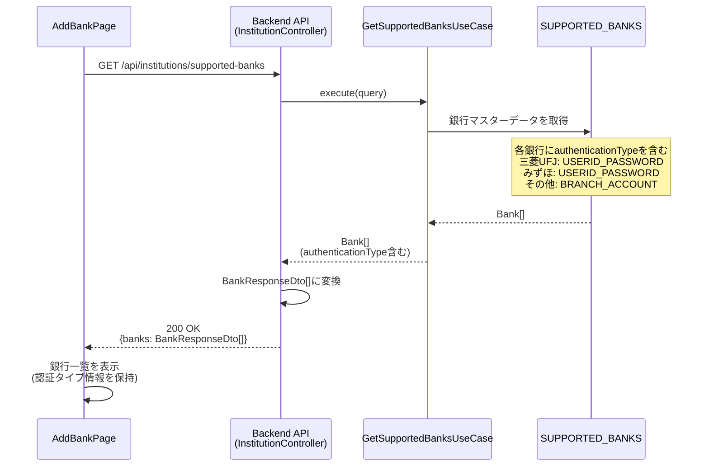

### ステップ詳細

1. **銀行一覧取得リクエスト**
   - エンドポイント: `GET /api/institutions/supported-banks`
   - クエリパラメータ: なし（または`category`、`searchTerm`）

2. **銀行マスターデータ取得**
   - `GetSupportedBanksUseCase`で`SUPPORTED_BANKS`から取得
   - 各銀行に`authenticationType`フィールドが含まれる

3. **レスポンス**
   - `BankResponseDto[]`を返す
   - 各銀行に`authenticationType`情報が含まれる

4. **フロントエンドでの利用**
   - 銀行選択時に`authenticationType`を確認
   - 認証方式に応じたフォームを表示

---

## エラーハンドリングフロー

### 認証方式不一致エラー (400 Bad Request)

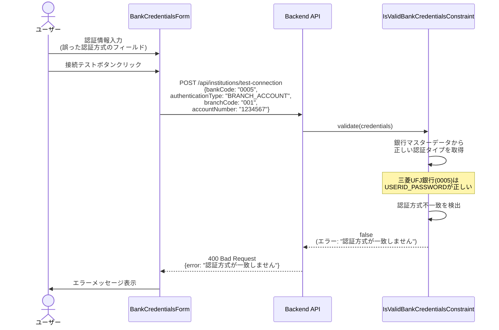

### 必須フィールド欠如エラー (400 Bad Request)

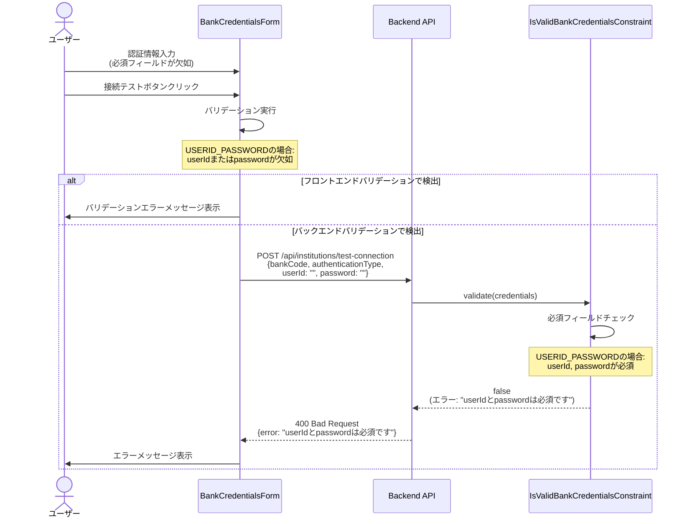

### 接続テスト失敗エラー (200 OK with error)

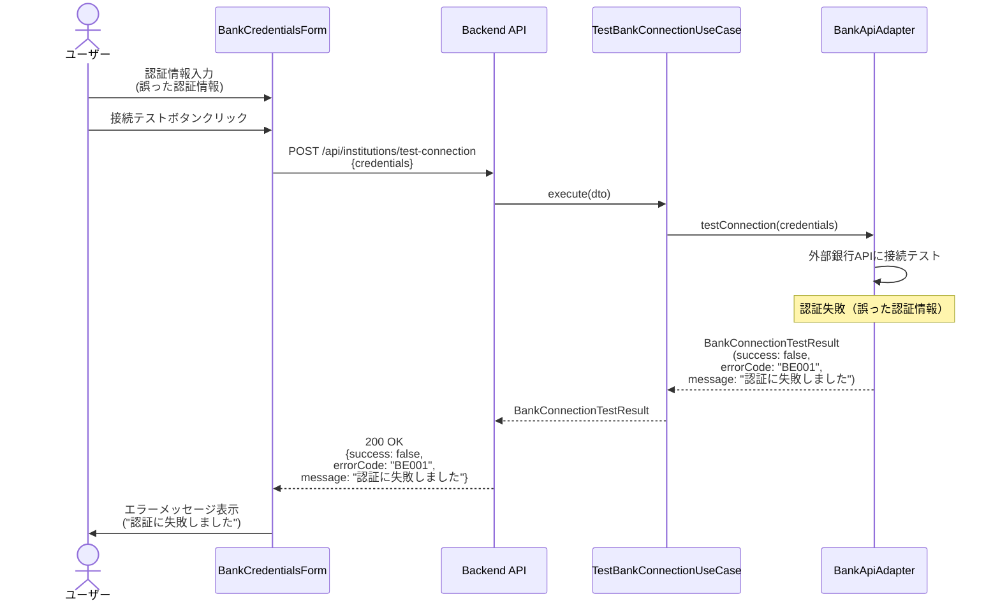

**エラーレスポンス例**:

```json
{
  "success": false,
  "message": "認証に失敗しました",
  "errorCode": "BE001",
  "accountInfo": null
}
```

---

## チェックリスト

シーケンス図作成時の確認事項：

### 基本項目

- [ ] 主要なユースケースがすべて記載されている
- [ ] アクター、参加者が明確に定義されている
- [ ] 正常系フローが記載されている
- [ ] 異常系フローが記載されている

### 詳細項目

- [ ] エラーハンドリングが明確
- [ ] トランザクション境界が明確（必要な場合）
- [ ] 非同期処理が適切に表現されている（必要な場合）
- [ ] レスポンスの型とステータスコードが明記されている

### 実装ガイド

- [ ] 各ステップに説明が付与されている
- [ ] 前提条件が明確
- [ ] 成功時の結果が明確

---

## Mermaid記法のヒント

### 基本構文

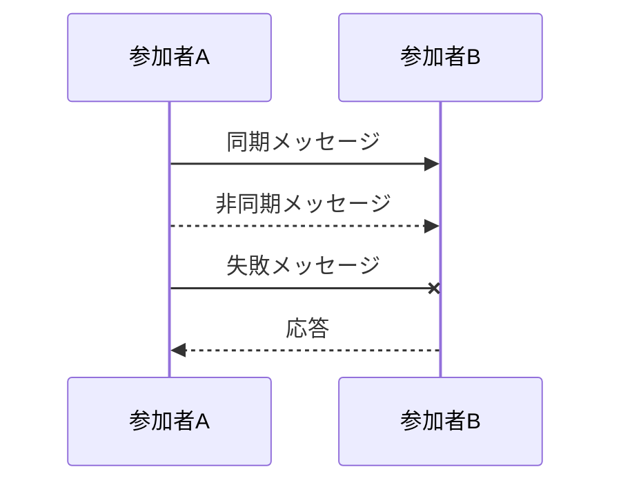

### 条件分岐

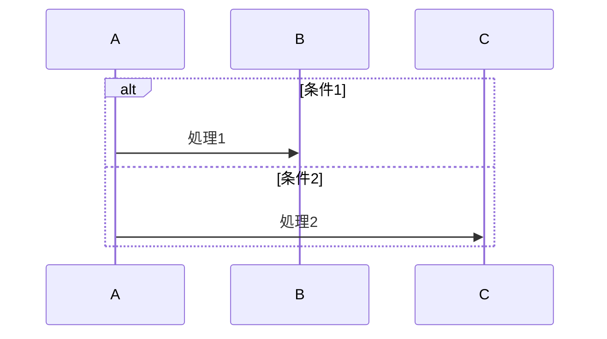

### ループ

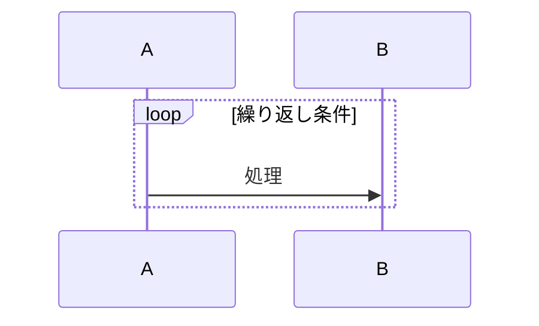

### 並行処理

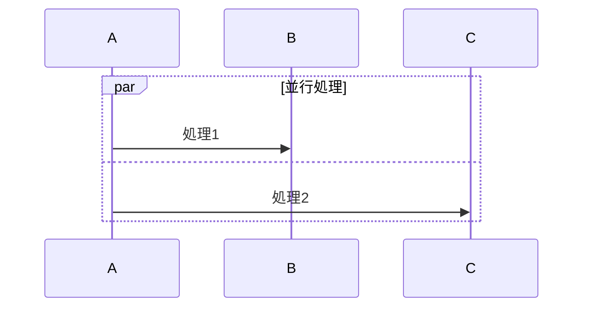

### ノート

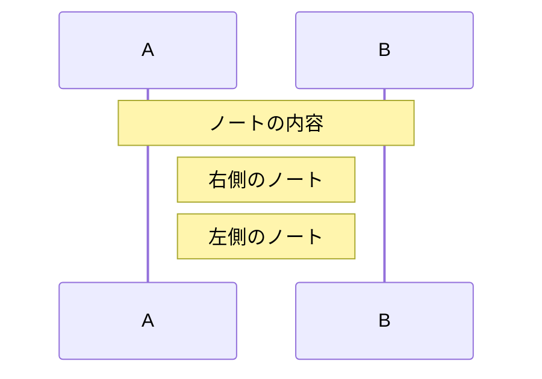
