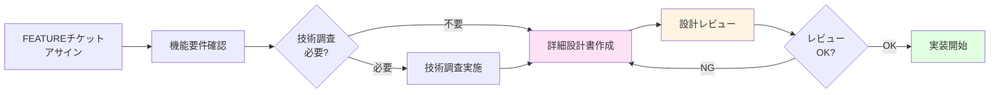
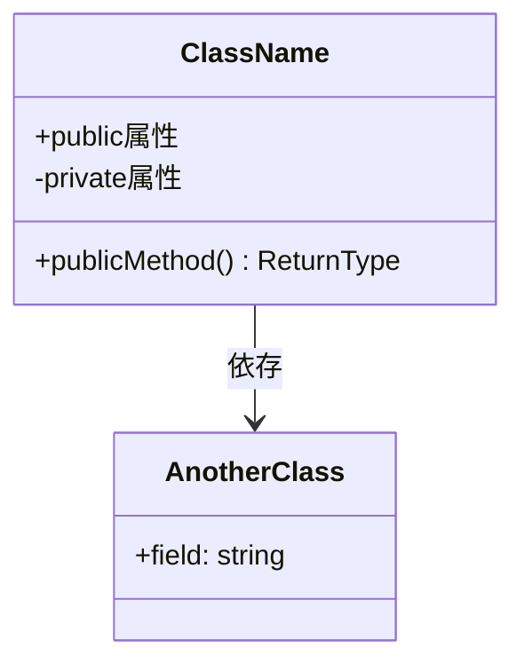
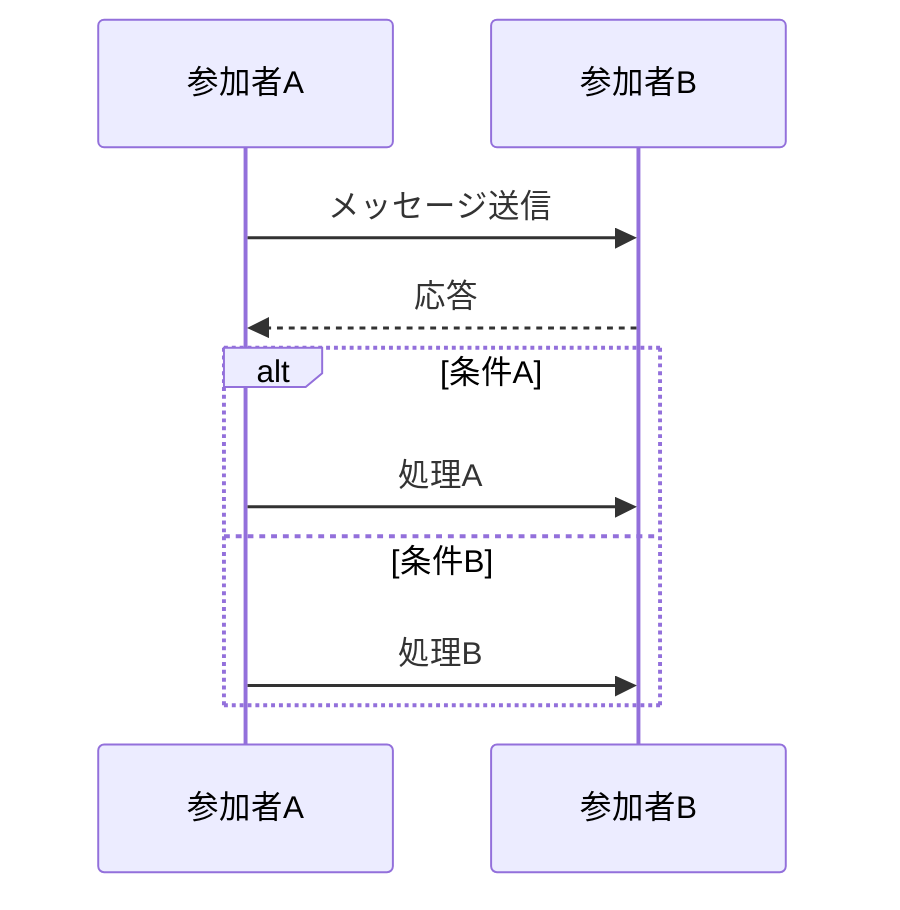
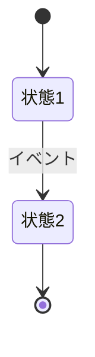
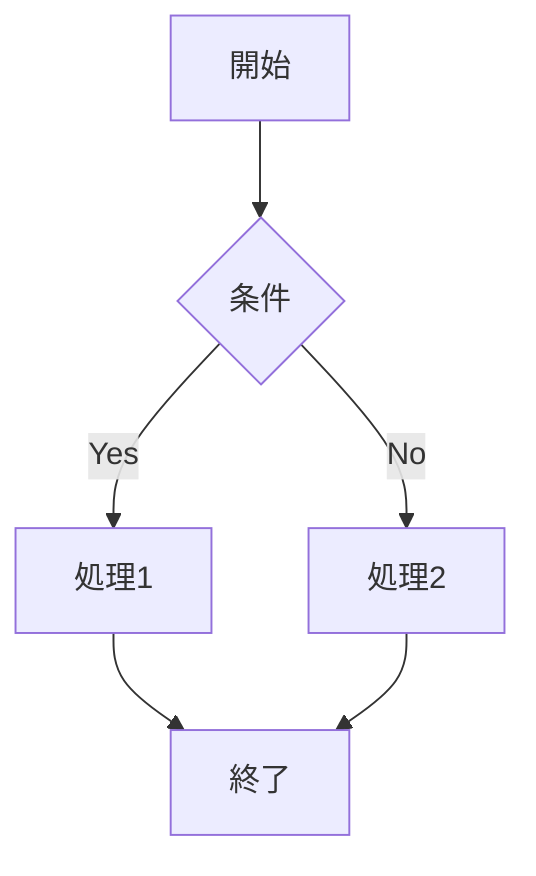
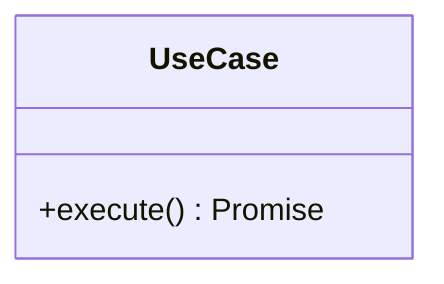
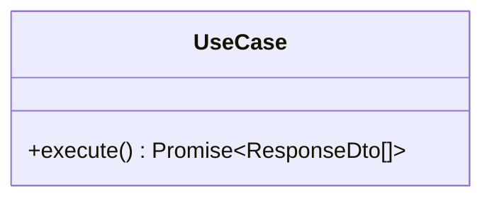

# 詳細設計書作成ガイドライン

このドキュメントは、FEATUREチケット開発時の詳細設計書作成に関するガイドラインです。

## 目次

1. [概要](#概要)
2. [作成タイミング](#作成タイミング)
3. [作成する設計書の粒度](#作成する設計書の粒度)
4. [設計書の構成](#設計書の構成)
5. [レビュープロセス](#レビュープロセス)
6. [更新ルール](#更新ルール)
7. [テンプレートの使い方](#テンプレートの使い方)
8. [Mermaid記法のガイド](#mermaid記法のガイド)

---

## 概要

### 目的

詳細設計書を作成する目的は以下の通りです：

1. **実装前の設計明確化**
   - 実装に入る前に技術的な詳細を明確にする
   - 手戻りを削減する

2. **レビュー品質の向上**
   - 設計段階でのレビューにより、アーキテクチャとの整合性を確保
   - コードレビュー時に設計意図が明確

3. **ドキュメントの最新性維持**
   - 実装前に作成するため、設計書と実装の乖離を防止
   - 常に最新の設計が文書化される

4. **ナレッジの蓄積**
   - 新規参画メンバーのオンボーディング時間短縮
   - 設計パターンの共有

### 基本原則

- **実装前に作成**: 実装開始前に設計書を作成し、レビューを受ける
- **必要十分な粒度**: 実装に必要な情報を過不足なく記載
- **Onion Architectureに準拠**: アーキテクチャとの整合性を保つ
- **型安全性の重視**: TypeScriptの型定義を明確にする
- **Mermaid記法の活用**: 図を使って視覚的に表現

---

## 作成タイミング

### フロー



### 各フェーズの詳細

#### 1. FEATUREチケットアサイン

- Issue が自分にアサインされた時点で開始

#### 2. 機能要件確認

- 機能要件書を確認
- 不明点があれば質問・確認

#### 3. 技術調査（必要な場合）

- 新しいライブラリの選定
- 技術的な実現可能性の確認
- パフォーマンス検証

#### 4. 詳細設計書作成

- **このタイミングで作成**
- テンプレートを使用
- 必須セクションは必ず作成

#### 5. 設計レビュー

- PRまたはIssueコメントでレビュー依頼
- フィードバックを反映

#### 6. 実装開始

- 設計書レビュー承認後に実装開始

---

## 作成する設計書の粒度

設計書は機能の複雑さに応じて、必須・推奨・オプションのセクションに分かれます。

### 必須セクション（すべてのFEATUREで作成）

| セクション   | ファイル               | 理由               |
| ------------ | ---------------------- | ------------------ |
| README       | README.md              | 設計書の概要と目次 |
| クラス図     | class-diagrams.md      | クラス構造の明確化 |
| シーケンス図 | sequence-diagrams.md   | 処理フローの明確化 |
| 入出力設計   | input-output-design.md | API仕様の明確化    |

**作成基準**: すべてのFEATUREチケットで必ず作成

**例外**: 以下の軽微な変更では省略可能

- バグ修正（既存設計の範囲内）
- リファクタリング（設計変更を伴わない）
- 設定値の変更のみ
- ドキュメント修正のみ
- テストコードの追加・修正のみ

### 推奨セクション（複雑な機能で作成）

| セクション | ファイル              | 作成条件             |
| ---------- | --------------------- | -------------------- |
| 画面遷移図 | screen-transitions.md | 画面を持つ機能       |
| 状態遷移図 | state-transitions.md  | 複雑な状態管理がある |

**作成基準**:

- **画面遷移図**: フロントエンドの画面がある場合
- **状態遷移図**: 3つ以上の状態があり、状態遷移ルールが複雑な場合

### オプションセクション（必要に応じて作成）

| セクション     | ファイル            | 作成条件         |
| -------------- | ------------------- | ---------------- |
| バッチ処理詳細 | batch-processing.md | バッチ処理がある |

**作成基準**:

- スケジュール実行されるバッチ処理がある場合

---

## 設計書の構成

### ディレクトリ構造

```
docs/detailed-design/
├── TEMPLATE/                          # テンプレート
│   ├── README.md.template
│   ├── class-diagrams.md.template
│   ├── sequence-diagrams.md.template
│   ├── screen-transitions.md.template
│   ├── state-transitions.md.template
│   ├── input-output-design.md.template
│   └── batch-processing.md.template
│
├── FR-001-005_institution-integration/  # 完了済み機能（参考例）
│   ├── README.md
│   ├── class-diagrams.md
│   ├── sequence-diagrams.md
│   ├── screen-transitions.md
│   ├── state-transitions.md
│   ├── input-output-design.md
│   └── batch-processing.md
│
└── FR-XXX_your-feature/                # 新規機能
    ├── README.md                        # 必須
    ├── class-diagrams.md                # 必須
    ├── sequence-diagrams.md             # 必須
    ├── input-output-design.md           # 必須
    ├── screen-transitions.md            # 推奨（画面がある場合）
    ├── state-transitions.md             # 推奨（状態管理が複雑な場合）
    └── batch-processing.md              # オプション（バッチ処理がある場合）
```

### ファイル命名規則

#### ディレクトリ名

**形式**: `FR-XXX[-YYY]_feature-name`

**ルール**:

- 英数字、ハイフン、アンダースコアのみ使用
- 小文字とケバブケースを使用
- FR番号を先頭に配置
- 複数のFRにまたがる場合は範囲を表記（例: FR-001-005）

**良い例**:

- `FR-006_transaction-sync`
- `FR-008-011_data-classification`
- `FR-023_monthly-income-graph`

**悪い例**:

- `feature-006` （FR番号が先頭にない）
- `FR_006_TransactionSync` （キャメルケース）
- `FR-006 取引同期` （日本語）

#### ファイル名

**形式**: テンプレートファイル名の`.template`を除いたもの

**例**:

- `README.md`
- `class-diagrams.md`
- `sequence-diagrams.md`

---

## レビュープロセス

### レビュアー

- **テックリード**: アーキテクチャとの整合性を確認
- **シニアエンジニア**: 設計の妥当性と実装可能性を確認

### レビュー方法

#### 方法1: GitHub PR（推奨）

1. 設計書を作成
2. PRを作成（`feature/issue-XXX-design`ブランチ）
3. レビュアーをアサイン
4. レビューコメントに対応
5. 承認後にmainへマージ
6. 実装用ブランチを作成（`feature/issue-XXX-implementation`）

#### 方法2: Issueコメント

1. 設計書を作成してコミット
2. Issueコメントでレビュー依頼
3. レビューコメントに対応
4. 承認後に実装開始

### レビュー観点

#### 1. アーキテクチャとの整合性

- [ ] Onion Architectureに準拠しているか
- [ ] 依存関係の方向が正しいか（外→内）
- [ ] レイヤごとの責務が適切か

#### 2. 設計の妥当性

- [ ] クラス設計が適切か
- [ ] メソッド名が適切か
- [ ] 責務が適切に分割されているか

#### 3. 実装可能性

- [ ] 技術的に実装可能か
- [ ] 想定される課題が考慮されているか
- [ ] 必要なライブラリが明確か

#### 4. パフォーマンス

- [ ] パフォーマンスボトルネックがないか
- [ ] データ量の増加に対応できるか
- [ ] キャッシング戦略が適切か

#### 5. セキュリティ

- [ ] 認証・認可が考慮されているか
- [ ] 入力値のバリデーションが適切か
- [ ] 機密情報の扱いが適切か

#### 6. 拡張性・保守性

- [ ] 将来の機能追加に対応できるか
- [ ] コードの保守がしやすいか
- [ ] テストしやすい設計か

#### 7. 設計の一貫性（Geminiレビューから学習）

- [ ] **エラーハンドリングの一貫性**
  - 空配列（[]）は正常な応答として扱う（500エラーにしない）
  - データが存在しないことはエラーではなく、正常なシナリオの一つ
  - 500エラーは予期しないエラー（DB接続失敗など）の場合のみ
- [ ] **営業日計算の正確性**
  - 営業日計算の例が正確か（±N営業日の計算が正しいか）
  - シーケンス図とREADMEの記述が一致しているか
- [ ] **ステータス更新の明確化**
  - どのエンティティのステータスを更新するか明確か
  - Reconciliation.statusとMonthlyCardSummary.statusを区別しているか
- [ ] **APIエンドポイント設計の一貫性**
  - RESTfulな設計原則に基づいているか
  - リソース名を複数形で統一しているか（例: `/api/reconciliations`）
  - 一覧取得はクエリパラメータで絞り込む設計か
- [ ] **エラー分類の一貫性**
  - リソースが存在しない場合は404（400ではない）
  - リクエスト形式が不正な場合は400
- [ ] **DTO設計の明確化**
  - 一覧取得用DTOと詳細取得用DTOを分けているか
  - 一覧取得では不要な情報（`results`など）を省略しているか
- [ ] **シーケンス図とREADMEの一貫性**
  - シーケンス図のメッセージがREADMEの仕様と一致しているか
  - 「営業日」の考慮が抜けていないか
- [ ] **エラーハンドリング方式の統一**
  - Resultパターンと例外スローの混在がないか
  - アプリケーション全体でエラーハンドリング方式が統一されているか
- [ ] **ステータス名とEnumの整合性**
  - 設計書で使用しているステータス名がEnum定義と一致しているか
  - 「支払済」「要確認」などの曖昧な表現ではなく、Enum値（MATCHED、PARTIAL、UNMATCHED）を使用しているか
- [ ] **共通エラーレスポンス形式の統一**
  - すべてのエラーレスポンスが共通形式に準拠しているか（success、statusCode、message、code、errors、timestamp、path）
  - エラーレスポンス例が共通形式と一致しているか
- [ ] **HTTPステータスコードの適切性**
  - 外部サービス障害の場合は502 Bad Gatewayまたは503 Service Unavailableを使用
  - 500 Internal Server Errorは自サーバーの内部ロジックエラーのみ
- [ ] **Presentation層のクラス図の完結性**
  - 参照されているDTO（例: DiscrepancyDto）がすべてクラス図に定義されているか
  - クラス図を見るだけでDTOの構造が理解できるか
- [ ] **シーケンス図の正確性**
  - パスパラメータとメソッド名が一致しているか（例: `GET /:id` → `findById(id)`）
  - 日付の例が正確か（曜日の確認）
  - 営業日計算の例が正確か
- [ ] **Value Objectの不変性**
  - Value Objectのメソッドは新しいインスタンスを返す設計か（voidではない）
  - 不変性（immutability）が保たれているか
- [ ] **エラーコードの命名規則**
  - エラーコードの命名規則が統一されているか
  - バリデーションエラーと機能固有のエラーで命名規則が明確か
- [ ] **HTTPステータスコードの適切な使い分け**
  - 外部サービス障害: 502 Bad Gateway / 503 Service Unavailable
  - 自サーバー内部の問題: 500 Internal Server Error
  - エラーの原因切り分けが容易になるよう適切に使い分けているか
- [ ] **集計メソッドの戻り値型の正確性**
  - カテゴリ別集計は`categoryId`ごとの集計が必要な場合、`Map<string, AggregationData>`を使用（`Map<CategoryType, AggregationData>`ではない）
  - 機能要件に応じた適切な粒度で集計する
- [ ] **Onion Architecture原則の徹底（エンティティとDTOの分離）**
  - レスポンスDTOがドメインエンティティを直接含まないこと
  - プレゼンテーション層がドメイン層のエンティティに直接依存しない
  - UseCase層でエンティティからDTOへの変換を実施
  - レスポンスDTOにはプレーンなDTO（`TransactionDto`など）を使用
- [ ] **計算ロジックのエッジケース明確化**
  - ゼロ除算が発生する可能性がある計算（例: 貯蓄率計算）で、分母が0の場合の処理を明記
  - 設計書にエッジケースの仕様を記載（例: `income`が0の場合は0を返す）
- [ ] **ドキュメントの整合性**
  - チェックリストの項目が現状と一致しているか
  - レスポンス例のJSONで`count`と配列の要素数が一致しているか
  - ドキュメント間で矛盾がないか
- [ ] **NestJSのベストプラクティス**
  - バリデーションは手動のif文チェックではなく、`class-validator`と`ValidationPipe`を使用
  - DTOにバリデーションルールを定義し、コントローラーから分離
  - `transform: true`オプションにより、クエリパラメータの自動変換を活用
- [ ] **クラス図の表現の明確性**
  - レスポンスDTOは`interface`で定義するため、Mermaidのクラス図では`<<interface>>`ステレオタイプを使用して明示
  - メソッドの引数型を明記（Mermaid構文上難しい場合は、メソッド説明で型を記載）
  - 未定義の型（例: `TransactionJSONResponse`）は注釈で説明を追加
- [ ] **プロパティ名の明確性**
  - プロパティ名は意図が明確になるよう命名（例: `incomeRate` → `incomeChangeRate`）
  - 「割合」と「増減率」を区別できる命名を推奨

---

## 13. 実装レビュー観点（Geminiレビューから学習）

### 13-1. エラーハンドリングの実装

- [ ] **例外ハンドリングの実装**
  - `handleError`メソッドが`never`型を返す場合、`return`を付けずに直接呼び出す
  - 例外が正しく伝播するように実装されているか
  - NestJSの標準的な例外フィルタリング機構をバイパスしていないか
- [ ] **関心の分離（レイヤ間の依存関係）**
  - UseCase層はフレームワーク（NestJS）に依存しないドメイン/アプリケーションエラーを直接スローする
  - HTTPステータスコードへの変換は、コントローラー層や例外フィルターが担当する
  - 例: UseCaseでは`CardSummaryNotFoundError`を直接スローし、`NotFoundException`は使わない

### 13-2. ビジネスロジックの実装

- [ ] **部分一致ロジックの実装**
  - 「最も近い日付の取引を選択」という要件を正しく実装しているか
  - 配列の最初の要素を選択するのではなく、日付の差が最小の要素を選択しているか
  - `reduce`や`sort`を使って適切に実装されているか
  - **複数候補の曖昧さの処理**
    - 同じ日付差の候補が複数ある場合（例: 支払日の前日と翌日に同額の取引）、`MultipleCandidateError`をスローしてユーザーに手動選択を促す
    - 曖昧さを隠蔽せず、明示的にエラーとして扱う

### 13-3. リポジトリ実装の最適化

- [ ] **シリアライズ/デシリアライズの最適化**
  - エンティティを直接配列に追加・更新できる場合は、不要なシリアライズ/デシリアライズを行わない
  - ファイル保存時のみシリアライズ、読み込み時のみデシリアライズを行う
  - コードの可読性とパフォーマンスのバランスを考慮しているか

### 13-4. エンティティIDの安定性

- [ ] **Upsertロジックの実装**
  - 再照合時にエンティティIDが変更されないように、既存エンティティを検索してIDを保持する
  - 新規作成時のみ新しいIDを生成し、更新時は既存のIDを使用する
  - `createdAt`も既存エンティティから保持する
  - エンティティIDの不変性を確保する

### 13-5. 日付計算の正確性

- [ ] **営業日数の計算**
  - 日付の「差」を計算する場合、期間の片方の端点のみを含める（両方を含めない）
  - 例: 2月27日と2月26日の差は1営業日（2ではない）
  - `while (current < end)`のように、終了日を含めないループを使用する
  - 不一致理由の表示に影響するため、正確性が重要

### 13-6. 型定義の明確化

- [ ] **型インポートの明確化**
  - `import()`構文を使った動的型インポートは避け、ファイル先頭で直接インポートする
  - 型定義が明確で、コードの可読性が高いか

### 13-7. コードの簡潔性

- [ ] **冗長な処理の削除**
  - `setDate`メソッドは`Date`オブジェクトを直接変更するため、ループ内で`new Date(currentDate)`を呼び出す必要はない
  - 変数が再代入されない場合は`const`を使用する（`prefer-const`ルールに準拠）
  - コードが簡潔で保守しやすいか

### 13-8. コードの重複回避

- [ ] **共通ロジックの抽出**
  - 営業日計算などの共通ロジックは、複数のクラスで重複実装しない
  - 共通ユーティリティファイルに切り出すことを検討する
  - DRY原則（Don't Repeat Yourself）に準拠しているか

### 13-9. テストコードの品質

- [ ] **未使用変数の削除**
  - テストコード内で宣言されているが、使用されていない変数はないか
  - `beforeEach`内で取得した変数が実際に使用されているか
  - 未使用の変数は削除してコードの可読性を向上させる

### 13-10. パフォーマンス最適化

- [ ] **非同期処理の並列化**
  - 互いに依存しない非同期処理は`Promise.all`を使用して並列実行する
  - データ取得処理など、順序に依存しない処理は並列化を検討する
  - 例: 当月・前月・前年同月のデータ取得は並列化可能

- [ ] **ループ処理の効率化**
  - ループ内で`find`や`filter`などの配列操作を繰り返し実行していないか
  - 事前にMapを作成してO(1)の検索に置き換えることで、計算量をO(M\*N)からO(M+N)に改善できる
  - 例: カテゴリIDとカテゴリ名のマップを事前に作成して、ループ内での検索を回避

### 13-11. ドメインサービスの設計

- [ ] **コード重複の削減**
  - 類似したロジックを持つメソッドは、汎用的なメソッドにリファクタリングする
  - キーセレクター関数を引数に取る汎用メソッドを作成することで、コードの重複を削減できる
  - 例: `aggregateByCategory`と`aggregateByInstitution`は、汎用的な`aggregateBy`メソッドに統合可能

### 13-12. Onion Architecture原則の徹底（Gemini PR#343レビューから学習）

- [ ] **Domain層のValue Object設計**
  - Domain層のValue Objectには、Application層で取得する情報（カテゴリ名など）を含めない
  - Domain層は`categoryId`のみを知っているべきで、`categoryName`はApplication層で`CategoryRepository`から取得してDTOに設定する
  - 例: `SubcategoryAggregationData`には`subcategoryId`のみを含め、`subcategoryName`は含めない
  - これにより、関心事の分離が明確になり、Onion Architecture原則に準拠する

- [ ] **APIレスポンスの一貫性**
  - クライアント側のデータハンドリングをシンプルにするため、レスポンス形式を統一する
  - 条件によって配列/オブジェクトを切り替えるのではなく、常に配列で返す（要素が1つの場合も配列）
  - 例: `categoryType`が指定された場合も`data: [{ ... }]`のように要素が1つの配列を返す

- [ ] **N+1問題の考慮**
  - シーケンス図でループ内でリポジトリメソッドを呼び出す場合は、N+1問題を考慮する
  - 必要なIDをすべて収集し、`findByIds`のような一括取得メソッドを使用する設計を検討する
  - 例: サブカテゴリごとに`findById`を呼び出すのではなく、`findByIds(categoryIds[])`で一括取得

- [ ] **型定義の一貫性**
  - JSONレスポンスではISO形式の文字列として返すため、型定義も`string`を使用する
  - `Date`型ではなく`string`型で定義することで、ドキュメントと実際のレスポンス形式が一致する
  - 例: `Period`インターフェースの`start`と`end`は`Date`ではなく`string`（ISO8601形式）

- [ ] **Mermaid記法の標準化**
  - ジェネリクスは`Promise<Type>`のように標準的な`<>`を使用する
  - `Promise~Type~`のような`~`記法は非標準のため、`<>`に統一する
  - TypeScriptコードとの一貫性を保つため、より一般的な`<>`を使用する

### 13-13. 実装時のパフォーマンスとロジックの正確性（Gemini PR#344レビューから学習）

- [ ] **集計ロジックの正確性**
  - カテゴリタイプ別に集計する場合、すべての集計処理（推移データ計算を含む）でカテゴリタイプでフィルタリングする
  - 例: `calculateTrend`メソッドは`categoryType`パラメータを受け取り、該当カテゴリタイプの取引のみを集計する
  - ユースケース側で既に期間でフィルタリング済みの取引が渡される場合、Domain層での日付フィルタリングは不要

- [ ] **パフォーマンス最適化**
  - ループ内で配列の`filter`を実行すると計算量がO(取引数 × サブカテゴリ数)になる
  - 事前にMapでグルーピングすることで、計算量をO(取引数)に改善できる
  - 例: サブカテゴリごとの取引を取得する際、ループ前に`Map<subcategoryId, Transaction[]>`を作成する

- [ ] **Enum値の動的取得**
  - ハードコードされたEnum値のリストは、Enumが変更された際に追従漏れが発生する可能性がある
  - `Object.values(EnumType)`を使用して動的にリストを生成することで、より堅牢な実装になる
  - 例: `targetCategoryTypes`は`Object.values(CategoryType)`で取得する

- [ ] **テストカバレッジ**
  - 新規追加したエンドポイントには必ずテストを追加する
  - クエリパラメータの組み合わせ（有無、値の種類）をテストする
  - UseCaseの呼び出しとレスポンスの検証を含める

- [ ] **コードの関心事の分離**
  - DTOはApplication層のAPIコントラクトを定義する重要な要素
  - UseCaseファイル内にDTOを定義するのではなく、`presentation/dto`または`application/dto`ディレクトリに別ファイルとして切り出すことを検討する
  - コードの見通しが良くなり、保守性が向上する

### レビューチェックリスト

```markdown
## 設計レビューチェックリスト

### アーキテクチャ

- [ ] Onion Architectureに準拠
- [ ] 依存関係の方向が正しい
- [ ] レイヤの責務が適切
- [ ] Domain層のValue ObjectにApplication層で取得する情報を含めていない

### 設計

- [ ] クラス設計が適切
- [ ] 処理フローが明確
- [ ] エラーハンドリングが考慮されている
- [ ] N+1問題が考慮されている
- [ ] 集計ロジックが正確（カテゴリタイプでフィルタリングされているか）
- [ ] パフォーマンスが考慮されている（ループ内の非効率な処理がないか）

### API

- [ ] エンドポイント設計が適切
- [ ] リクエスト/レスポンスの型が明確
- [ ] バリデーションルールが定義されている
- [ ] レスポンス形式が一貫している（配列/オブジェクトの統一）

### 品質

- [ ] パフォーマンスが考慮されている（計算量の最適化、事前グルーピングなど）
- [ ] セキュリティが考慮されている
- [ ] テストしやすい設計
- [ ] 新規エンドポイントのテストが追加されている
- [ ] Enum値の動的取得が使用されている（ハードコードされていない）

### ドキュメント

- [ ] 必須セクションがすべて作成されている
- [ ] 図が分かりやすい
- [ ] 説明が十分
- [ ] Mermaid記法が標準的（ジェネリクスは`<>`を使用）

### その他

- [ ] 既存の設計パターンと一貫性がある
- [ ] 技術的負債を生まない設計
- [ ] 型定義が実際のレスポンス形式と一致している
```

---

## 更新ルール

### 実装中の設計変更

実装中に設計変更が必要になった場合の対応：

#### ケース1: 軽微な変更

**例**: メソッド名の変更、バリデーションルールの追加

**対応**:

1. 実装と同時に設計書を更新
2. 同じPRでコミット
3. PRのコメントで変更理由を説明

#### ケース2: 大きな変更

**例**: クラス構造の変更、処理フローの大幅な変更

**対応**:

1. まず設計書を更新
2. レビューを受ける
3. 承認後に実装を変更

### 更新時の注意点

- **変更理由の記載**: なぜ変更が必要だったかを記載
- **変更履歴の記録**: README.mdの変更履歴セクションに記録
- **関連ドキュメントの更新**: 機能要件書等も必要に応じて更新

### 変更履歴の記録

README.mdに以下のセクションを設ける：

```markdown
## 変更履歴

| バージョン | 日付       | 変更内容         | 変更理由                 | 作成者 |
| ---------- | ---------- | ---------------- | ------------------------ | ------ |
| 1.1        | 2025-11-22 | クラス構造を変更 | パフォーマンス改善のため | [名前] |
| 1.0        | 2025-11-21 | 初版作成         | -                        | [名前] |
```

---

## テンプレートの使い方

### 基本的な流れ

1. **テンプレートのコピー**

```bash
# 新しい機能のディレクトリを作成
mkdir -p docs/detailed-design/FR-XXX_feature-name

# テンプレートをコピー
cp docs/detailed-design/TEMPLATE/*.template docs/detailed-design/FR-XXX_feature-name/

# .templateを削除してリネーム
cd docs/detailed-design/FR-XXX_feature-name
for file in *.template; do
  mv "$file" "${file%.template}"
done
```

2. **プレースホルダーの置換**

各ファイルのプレースホルダーを実際の値に置換：

- `[機能名]` → 実際の機能名
- `FR-XXX` → 実際のFR番号
- `[EntityName]` → 実際のエンティティ名
- その他の`[xxx]` → 実際の値

3. **不要なセクションの削除**

推奨セクションやオプションセクションで不要なものは削除：

```bash
# 画面がない場合
rm screen-transitions.md

# 状態管理が単純な場合
rm state-transitions.md

# バッチ処理がない場合
rm batch-processing.md
```

4. **内容の記載**

- 既存の設計書（FR-001-005）を参考にする
- Mermaid記法で図を作成
- 実装に必要な情報を過不足なく記載

5. **チェックリストで確認**

各ファイルの末尾にあるチェックリストで記載漏れを確認

### 参考例の活用

`FR-001-005_institution-integration/` は完成された設計書の例です：

- **クラス図の書き方**: 各レイヤのクラスをどう表現するか
- **シーケンス図の書き方**: 正常系・異常系の表現方法
- **API仕様の書き方**: リクエスト/レスポンスの記載方法

積極的に参考にしてください。

---

## Mermaid記法のガイド

### 基本

Mermaidは図を簡単に作成できるマークダウン記法です。

#### クラス図



#### シーケンス図



#### 状態遷移図



#### フローチャート



### ヒント

1. **プレビューを活用**: VS Codeの拡張機能でリアルタイムプレビュー
2. **段階的に作成**: 最初はシンプルに、徐々に詳細化
3. **既存の図を参考**: FR-001-005の図を参考にする
4. **Mermaidドキュメント**: [公式ドキュメント](https://mermaid.js.org/)を参照

### ジェネリクス表記の標準化

Mermaidクラス図でジェネリクスを表現する際は、TypeScriptコードとの一貫性を保つため、標準的な`<>`記法を使用します。

**✅ 推奨:**



**❌ 非推奨:**



**理由:**

- TypeScriptコードとの一貫性が取れる
- より一般的で可読性が高い
- Mermaidの標準的な記法に準拠

---

## よくある質問

### Q1: すべてのセクションを作成する必要がありますか？

A: いいえ。必須セクション（README、クラス図、シーケンス図、入出力設計）は必ず作成してください。推奨・オプションセクションは機能に応じて判断してください。

### Q2: 設計書の粒度はどこまで詳細にすべきですか？

A: 実装者が設計書を見て実装できるレベルが目安です。すべてのメソッドを記載する必要はなく、主要なクラスとメソッドに絞ってください。

### Q3: Mermaid記法が難しいです

A: 既存の設計書（FR-001-005）をコピーして、内容を書き換えるのが早いです。またVS Codeのプレビュー機能を活用してください。

### Q4: 実装中に設計が変わった場合はどうすればいいですか？

A: 軽微な変更は実装PRで一緒にコミット、大きな変更は設計書を先に更新してレビューを受けてください。

### Q5: バグ修正でも設計書は必要ですか？

A: 既存設計の範囲内のバグ修正では不要です。設計変更を伴う場合は作成してください。

---

## まとめ

### 重要なポイント

1. ✅ **実装前に作成**: 設計を明確にしてから実装
2. ✅ **必須セクションは必ず作成**: README、クラス図、シーケンス図、入出力設計
3. ✅ **テンプレートを活用**: 効率的に作成
4. ✅ **レビューを受ける**: 設計の品質を担保
5. ✅ **実装と乖離させない**: 変更時は設計書も更新

### 期待される効果

- 🎯 手戻りの削減
- 🎯 レビュー品質の向上
- 🎯 ドキュメントの最新性維持
- 🎯 オンボーディング時間の短縮
- 🎯 設計パターンの共有

---

## 参考リンク

- [テンプレート](../detailed-design/TEMPLATE/)
- [参考例: FR-001-005](../detailed-design/FR-001-005_institution-integration/)
- [機能要件書](../functional-requirements/)
- [システムアーキテクチャ](../system-architecture.md)
- [Mermaid Documentation](https://mermaid.js.org/)
